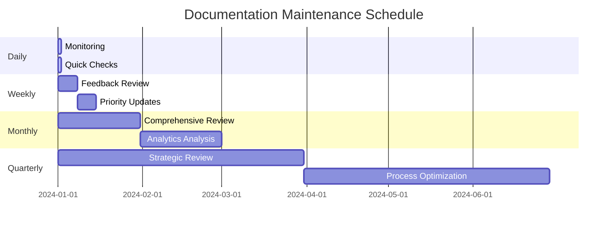

# Documentation Maintenance Schedule

## 🎯 Purpose
This schedule provides specific timing and responsibilities for all documentation maintenance activities, ensuring sustainable and systematic upkeep of AI agent onboarding documentation. It integrates maintenance checklists, feedback processing, review cycles, and versioning into a practical operational rhythm.

## 📅 Maintenance Rhythm Overview



## 🕒 Daily Activities (5-10 minutes)

### Automated Monitoring
**Time**: Runs continuously via CI/CD
**Owner**: Automation systems
**Backup**: Documentation maintainer

```yaml
daily_automated_activities:
  continuous_monitoring:
    - broken_link_detection: github_actions
    - code_example_validation: ci_pipeline
    - performance_regression_alerts: monitoring_system
    - user_feedback_notifications: issue_tracking
  
  morning_dashboard_check:
    - new_issues_and_feedback: 2_minutes
    - failed_validation_alerts: 1_minute
    - overnight_usage_analytics: 2_minutes
```

### Quick Manual Checks
**Time**: 08:00 - 08:10 daily
**Owner**: Documentation maintainer on rotation
**Duration**: 10 minutes

```bash
#!/bin/bash
# Daily quick check script (scripts/daily-docs-check.sh)

echo "📊 Daily Documentation Health Check - $(date)"

# 1. Check for critical alerts (2 min)
echo "🚨 Checking critical alerts..."
gh issue list --label "documentation,critical" --state open --limit 5

# 2. Review overnight feedback (3 min)
echo "💬 Checking new feedback..."
gh issue list --label "documentation" --state open --created ">=$(date -d '1 day ago' --iso-8601)" --limit 10

# 3. Validate key documentation files (3 min)
echo "✅ Quick validation check..."
scripts/validate-docs.sh --quick

# 4. Check analytics for anomalies (2 min)
echo "📈 Checking usage patterns..."
scripts/check-usage-anomalies.sh

echo "✅ Daily check complete"
```

## 📅 Weekly Activities (2-3 hours)

### Monday: Feedback Processing and Triage
**Time**: Monday 09:00 - 10:00
**Owner**: Documentation maintainer
**Duration**: 60 minutes

```yaml
monday_feedback_triage:
  week_1_of_month:
    - new_feedback_review: 20_minutes
    - priority_classification: 15_minutes
    - quick_fixes_implementation: 20_minutes
    - escalation_planning: 5_minutes
  
  other_weeks:
    - feedback_review_and_classification: 30_minutes
    - immediate_fixes: 25_minutes
    - planning_updates: 5_minutes
```

**Process**:
```bash
# Weekly feedback processing script
scripts/weekly-feedback-process.sh

# 1. Generate feedback report
echo "📊 Generating weekly feedback report..."
scripts/generate-feedback-report.sh weekly

# 2. Process new issues
echo "🔍 Processing new documentation issues..."
gh issue list --label "documentation" --state open --created ">=$(date -d '7 days ago' --iso-8601)"

# 3. Quick wins implementation
echo "⚡ Implementing quick fixes..."
# Process issues marked as "quick-fix" or "good-first-issue"

# 4. Update weekly metrics
echo "📈 Updating weekly metrics..."
scripts/update-weekly-metrics.sh
```

### Wednesday: Content Validation and Updates
**Time**: Wednesday 14:00 - 15:30  
**Owner**: Technical lead + Documentation maintainer
**Duration**: 90 minutes

```yaml
wednesday_validation:
  technical_accuracy_check:
    - code_examples_testing: 30_minutes
    - api_endpoints_verification: 20_minutes
    - performance_metrics_validation: 20_minutes
  
  content_updates:
    - outdated_information_fixes: 15_minutes
    - new_pattern_documentation: 5_minutes
```

**Process**:
```bash
# Weekly validation and update script
scripts/weekly-validation-update.sh

# 1. Run comprehensive validation
echo "🔍 Running comprehensive validation..."
scripts/validate-docs.sh --comprehensive

# 2. Test all code examples
echo "💻 Testing code examples..."
poetry run python -m pytest docs/ --doctest-modules -v

# 3. Check performance benchmarks
echo "⚡ Validating performance examples..."
scripts/benchmark-validation.sh

# 4. Update any discovered issues
echo "🔧 Applying necessary updates..."
# Process and fix validation failures
```

### Friday: Review and Planning
**Time**: Friday 16:00 - 16:30
**Owner**: Documentation team
**Duration**: 30 minutes

```yaml
friday_review:
  week_completion_review:
    - metrics_analysis: 10_minutes
    - blockers_identification: 10_minutes
    - next_week_planning: 10_minutes
```

## 🗓️ Monthly Activities (4-6 hours)

### First Monday: Comprehensive Documentation Review
**Time**: First Monday of month, 09:00 - 12:00
**Owner**: Full documentation team
**Duration**: 3 hours

```yaml
monthly_comprehensive_review:
  documentation_audit:
    - accuracy_verification: 60_minutes
    - completeness_assessment: 45_minutes
    - usability_evaluation: 45_minutes
    - maintenance_burden_analysis: 30_minutes
  
  strategic_planning:
    - priority_updates_scheduling: 15_minutes
    - resource_allocation: 15_minutes
```

**Process**:
```bash
# Monthly comprehensive review script
scripts/monthly-comprehensive-review.sh

# 1. Generate monthly analytics report
echo "📊 Generating monthly analytics..."
scripts/generate-feedback-report.sh monthly
scripts/generate-usage-analytics.sh monthly

# 2. Perform file-by-file review
echo "📋 Performing systematic review..."
for file in docs/architecture/*.md; do
    echo "Reviewing: $file"
    scripts/single-file-audit.sh "$file"
done

# 3. Identify improvement opportunities
echo "🎯 Identifying improvements..."
scripts/identify-improvement-opportunities.sh

# 4. Update maintenance backlog
echo "📝 Updating maintenance backlog..."
scripts/update-maintenance-backlog.sh
```

### Second Wednesday: Analytics Deep Dive
**Time**: Second Wednesday of month, 14:00 - 16:00
**Owner**: Documentation maintainer + Analytics expert
**Duration**: 2 hours

```yaml
monthly_analytics_review:
  usage_pattern_analysis:
    - traffic_analysis: 30_minutes
    - user_journey_mapping: 30_minutes
    - bottleneck_identification: 30_minutes
  
  effectiveness_measurement:
    - onboarding_success_metrics: 20_minutes
    - documentation_roi_analysis: 10_minutes
```

### Third Friday: Update Implementation
**Time**: Third Friday of month, 09:00 - 12:00
**Owner**: Documentation team
**Duration**: 3 hours

```yaml
monthly_update_implementation:
  priority_updates:
    - critical_fixes: 90_minutes
    - enhancement_implementation: 60_minutes
    - validation_and_testing: 30_minutes
```

## 📋 Quarterly Activities (1-2 days)

### Quarter Planning Week: Strategic Review
**Time**: First week of quarter (Monday-Tuesday)
**Owner**: Documentation team + Stakeholders
**Duration**: 2 days

#### Day 1: Assessment and Analysis
```yaml
quarterly_assessment:
  morning_session:
    - comprehensive_metrics_review: 2_hours
    - user_feedback_trend_analysis: 1_hour
    - documentation_effectiveness_audit: 1_hour
  
  afternoon_session:
    - stakeholder_feedback_collection: 1_hour
    - competitor_analysis: 1_hour
    - technology_trend_assessment: 1_hour
    - gap_analysis: 1_hour
```

#### Day 2: Strategy and Planning
```yaml
quarterly_planning:
  morning_session:
    - strategic_objectives_setting: 1_hour
    - resource_allocation_planning: 1_hour
    - technology_roadmap_alignment: 1_hour
    - risk_assessment: 1_hour
  
  afternoon_session:
    - quarterly_okr_definition: 1_hour
    - project_prioritization: 1_hour
    - timeline_development: 1_hour
    - success_metrics_definition: 1_hour
```

**Quarterly Review Process**:
```bash
# Quarterly strategic review script
scripts/quarterly-strategic-review.sh

# 1. Generate comprehensive quarterly report
echo "📊 Generating quarterly comprehensive report..."
scripts/generate-quarterly-report.sh

# 2. Stakeholder interview compilation
echo "🗣️ Compiling stakeholder feedback..."
scripts/compile-stakeholder-feedback.sh

# 3. Competitive analysis
echo "🔍 Performing competitive analysis..."
scripts/competitive-documentation-analysis.sh

# 4. Strategic planning workshop preparation
echo "📋 Preparing strategic planning materials..."
scripts/prepare-quarterly-planning.sh
```

## 🚨 Event-Driven Activities

### Release-Triggered Maintenance
**Trigger**: Major code release or architecture change
**Timeline**: Within 48 hours of release
**Duration**: 4-8 hours depending on scope

```yaml
release_triggered_maintenance:
  immediate_response:
    - impact_assessment: 30_minutes
    - critical_updates_identification: 60_minutes
    - priority_fixes_implementation: 120-240_minutes
  
  follow_up:
    - comprehensive_validation: 60_minutes
    - user_communication: 30_minutes
    - lessons_learned_documentation: 30_minutes
```

### Critical Issue Response
**Trigger**: Critical documentation bug or blocking issue
**Timeline**: Within 4 hours
**Duration**: 2-4 hours

```yaml
critical_issue_response:
  emergency_protocol:
    - issue_triage: 15_minutes
    - impact_assessment: 15_minutes
    - immediate_fix_implementation: 60-120_minutes
    - validation_and_testing: 30_minutes
    - deployment_and_communication: 30_minutes
  
  post_incident:
    - root_cause_analysis: 60_minutes
    - process_improvement: 30_minutes
```

## 👥 Responsibility Matrix

### Primary Responsibilities
```yaml
documentation_maintainer:
  daily:
    - monitoring_dashboard_check: 5_minutes
    - critical_alert_response: as_needed
  
  weekly:
    - feedback_processing: 60_minutes
    - validation_coordination: 30_minutes
    - metrics_tracking: 15_minutes
  
  monthly:
    - comprehensive_review_coordination: 180_minutes
    - analytics_analysis: 60_minutes
    - update_implementation: 120_minutes

technical_lead:
  weekly:
    - technical_accuracy_validation: 60_minutes
    - architecture_alignment_review: 30_minutes
  
  monthly:
    - strategic_input: 60_minutes
    - technical_roadmap_alignment: 30_minutes
  
  quarterly:
    - strategic_planning_participation: 480_minutes

documentation_team:
  monthly:
    - team_review_session: 180_minutes
    - collaborative_updates: 120_minutes
  
  quarterly:
    - strategic_planning: 960_minutes
    - okr_planning: 240_minutes

stakeholders:
  quarterly:
    - feedback_provision: 60_minutes
    - strategic_input: 120_minutes
    - requirement_definition: 60_minutes
```

### Backup Coverage
```yaml
backup_assignments:
  documentation_maintainer_backup:
    - secondary_maintainer: handles_daily_during_absence
    - technical_lead: covers_weekly_critical_activities
  
  technical_lead_backup:
    - senior_developer: technical_validation_coverage
    - architecture_team: architecture_review_coverage
  
  emergency_coverage:
    - on_call_rotation: 24_7_critical_issue_response
    - escalation_chain: clear_contact_hierarchy
```

## 📊 Success Metrics and Tracking

### Daily Metrics
```yaml
daily_tracking:
  automation_health:
    - validation_pass_rate: target_>95%
    - broken_link_detection: target_0_critical
    - ci_pipeline_success: target_>98%
  
  feedback_responsiveness:
    - critical_issue_response_time: target_<4_hours
    - feedback_acknowledgment_time: target_<24_hours
```

### Weekly Metrics
```yaml
weekly_tracking:
  maintenance_effectiveness:
    - issues_resolved: count_and_severity
    - feedback_processing_rate: target_>90%
    - validation_coverage: target_100%_key_files
  
  content_quality:
    - accuracy_score: user_reported_issues
    - completeness_assessment: quarterly_audit_scores
    - usability_feedback: user_satisfaction_ratings
```

### Monthly Metrics
```yaml
monthly_tracking:
  strategic_alignment:
    - documentation_coverage: new_features_documented
    - update_velocity: average_time_feature_to_docs
    - user_success_rate: onboarding_completion_metrics
  
  maintenance_efficiency:
    - maintenance_time_investment: hours_per_month
    - roi_measurement: productivity_gains_vs_investment
    - technical_debt: outstanding_improvement_backlog
```

### Quarterly Metrics
```yaml
quarterly_tracking:
  strategic_outcomes:
    - okr_achievement: percentage_completion
    - user_satisfaction: comprehensive_survey_results
    - business_impact: measurable_productivity_improvements
  
  process_maturity:
    - automation_percentage: manual_vs_automated_tasks
    - predictability: variance_in_maintenance_effort
    - sustainability: maintainer_satisfaction_and_retention
```

## 🛠️ Tooling and Automation

### Scheduling Tools
```yaml
calendar_management:
  recurring_meetings:
    - weekly_feedback_review: mondays_9am
    - weekly_validation_session: wednesdays_2pm
    - monthly_comprehensive_review: first_monday_9am
    - quarterly_strategic_planning: quarter_start_week
  
  automated_reminders:
    - daily_check_reminder: 8am_notification
    - weekly_prep_reminder: friday_4pm_for_monday
    - monthly_prep_reminder: week_before_review
    - quarterly_prep_reminder: month_before_planning
```

### Automation Scripts
```bash
# Core automation scripts location: scripts/maintenance/

# Daily automation
scripts/maintenance/daily-health-check.sh
scripts/maintenance/automated-monitoring.sh

# Weekly automation  
scripts/maintenance/weekly-feedback-process.sh
scripts/maintenance/weekly-validation.sh
scripts/maintenance/weekly-metrics-update.sh

# Monthly automation
scripts/maintenance/monthly-comprehensive-review.sh
scripts/maintenance/monthly-analytics-analysis.sh
scripts/maintenance/monthly-update-implementation.sh

# Quarterly automation
scripts/maintenance/quarterly-report-generation.sh
scripts/maintenance/quarterly-strategic-analysis.sh

# Event-driven automation
scripts/maintenance/release-triggered-maintenance.sh
scripts/maintenance/critical-issue-response.sh
```

### Integration Points
```yaml
tool_integrations:
  project_management:
    - github_issues: automatic_maintenance_task_creation
    - project_boards: progress_tracking_automation
    - milestone_tracking: quarterly_okr_alignment
  
  communication:
    - slack_notifications: maintenance_activity_updates
    - email_digests: weekly_summary_reports
    - team_dashboards: real_time_health_metrics
  
  validation_tools:
    - ci_cd_integration: automated_validation_triggers
    - monitoring_systems: real_time_health_monitoring
    - analytics_platforms: usage_pattern_tracking
```

## 🔄 Schedule Optimization

### Continuous Improvement Process
```yaml
schedule_optimization:
  monthly_assessment:
    - time_allocation_analysis: actual_vs_planned_time
    - bottleneck_identification: process_friction_points
    - efficiency_opportunities: automation_potential
  
  quarterly_adjustment:
    - schedule_effectiveness_review: outcome_vs_effort_analysis
    - stakeholder_feedback_integration: user_needs_alignment
    - resource_reallocation: priority_based_optimization
  
  annual_overhaul:
    - comprehensive_process_audit: end_to_end_evaluation
    - industry_best_practices_integration: external_benchmark
    - major_process_improvements: strategic_schedule_redesign
```

### Adaptive Scheduling
```yaml
adaptive_mechanisms:
  workload_scaling:
    - high_activity_periods: increased_validation_frequency
    - low_activity_periods: deep_improvement_work
    - release_cycles: aligned_maintenance_intensity
  
  team_capacity_adjustment:
    - vacation_coverage: backup_schedule_activation
    - team_growth: responsibility_redistribution
    - skill_development: training_time_allocation
  
  priority_rebalancing:
    - critical_issue_surge: emergency_schedule_activation
    - strategic_initiative_launch: resource_reallocation
    - user_feedback_trends: focus_area_adjustment
```

## 🎯 Success Criteria

### Schedule Effectiveness Indicators
```yaml
effectiveness_measures:
  maintenance_quality:
    - documentation_accuracy: >95%_validation_pass_rate
    - user_satisfaction: >85%_positive_feedback
    - issue_resolution_speed: <24_hours_average_response
  
  operational_efficiency:
    - schedule_adherence: >90%_planned_activities_completed
    - resource_utilization: optimal_time_investment_roi
    - automation_coverage: >70%_routine_tasks_automated
  
  strategic_alignment:
    - business_goal_support: documented_productivity_improvements
    - stakeholder_satisfaction: >80%_positive_feedback
    - continuous_improvement: measurable_process_enhancements
```

## 🔗 Related Documents
- [Documentation Maintenance Checklist](./documentation-maintenance-checklist.md)
- [Documentation Versioning Strategy](./documentation-versioning-strategy.md)
- [Documentation Feedback Loops](./documentation-feedback-loops.md)
- [Documentation Review Guidelines](./documentation-review-guidelines.md)
- [AI Agent Workflows](./ai-agent-workflows.md)

---

*This maintenance schedule ensures systematic, sustainable documentation upkeep through clearly defined rhythms, responsibilities, and success metrics, supporting long-term AI agent onboarding effectiveness.* 