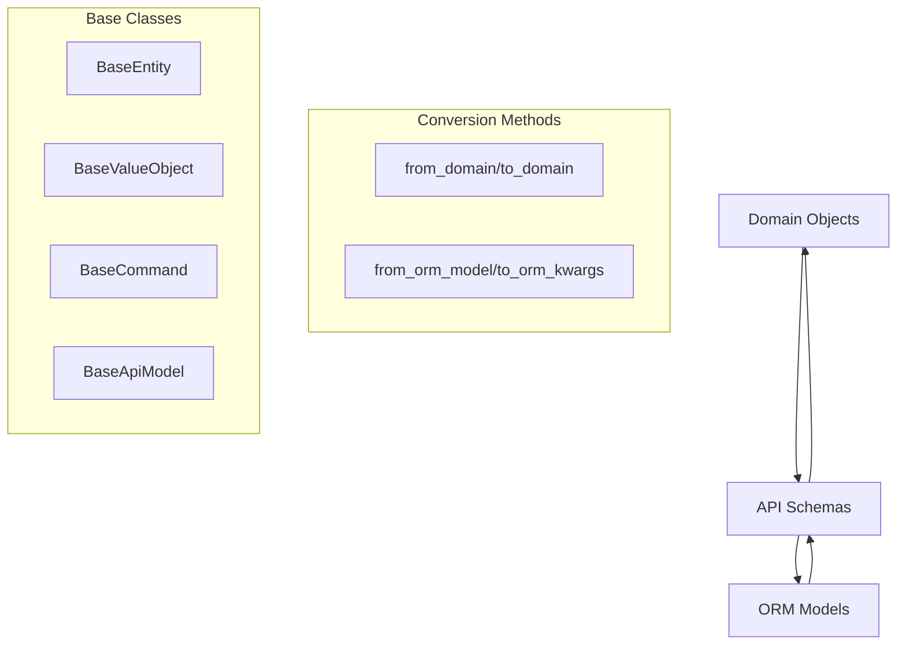

# PRD: API Schema Standardization & Pattern Enforcement

## Executive Summary

### Problem Statement
Current API Pydantic schemas across the codebase have inconsistent implementation patterns, making it difficult for developers to reason about API layer errors that frequently occur. The lack of standardization creates confusion about where errors originate and how they should be handled, impacting developer productivity and system reliability.

### Proposed Solution
Systematically update all API Pydantic classes to align with the documented patterns in `docs/schema-patterns.md` and `docs/adr-enhanced-entity-patterns.md`. This includes enforcing strict validation, implementing required conversion methods, and ensuring consistent error handling patterns across all contexts.

### Business Value
- **Improved Developer Experience**: Clear, consistent patterns reduce cognitive load when working with API schemas
- **Enhanced Error Clarity**: Standardized validation and conversion patterns make error sources immediately identifiable
- **Reduced Debugging Time**: Consistent implementation patterns enable faster issue resolution
- **Better Code Maintainability**: Uniform patterns across codebase improve long-term maintainability

### Success Criteria
- All API schemas implement the four required conversion methods (`from_domain`, `to_domain`, `from_orm_model`, `to_orm_kwargs`)
- 100% compliance with documented type conversion patterns
- All schemas inherit from appropriate base classes (`BaseEntity`, `BaseValueObject`, `BaseCommand`)
- Comprehensive test coverage for all conversion methods
- Zero breaking changes to existing API contracts

## Goals and Non-Goals

### Goals
1. **Pattern Compliance**: Update all API schemas to follow documented patterns in `docs/schema-patterns.md`
2. **Type Safety**: Implement strict validation with proper type conversions in all conversion methods
3. **Error Clarity**: Standardize error handling to make API layer issues immediately identifiable
4. **Test Coverage**: Ensure comprehensive testing of all conversion methods and validation scenarios
5. **Documentation Alignment**: Make codebase fully consistent with architectural documentation
6. **Incremental Implementation**: Enable safe, incremental rollout without breaking existing functionality

### Non-Goals (Out of Scope)
1. **API Contract Changes**: No modifications to existing API endpoint signatures or response formats
2. **Performance Optimization**: Focus is on standardization, not performance improvements
3. **New Feature Development**: No new API functionality will be added
4. **Database Schema Changes**: No modifications to underlying ORM models or database structure
5. **Legacy Schema Removal**: Deprecated schemas will be updated but not removed

## User Stories and Acceptance Criteria

### User Story 1: Clear Error Attribution
**As a** developer debugging API issues
**I want to** immediately understand whether validation errors originate from domain conversion, ORM mapping, or API validation
**So that** I can quickly identify and fix the root cause

**Acceptance Criteria:**
- [ ] All conversion methods use consistent error handling patterns
- [ ] Error messages clearly indicate conversion direction (domain→API, API→ORM, etc.)
- [ ] ValidationError includes schema class and field information
- [ ] Error logs contain structured context for debugging

### User Story 2: Predictable Type Conversions
**As a** developer implementing new API endpoints
**I want to** have clear, documented patterns for type conversions between layers
**So that** I can implement schemas correctly the first time

**Acceptance Criteria:**
- [ ] All UUID↔String conversions handled in conversion methods
- [ ] All Enum↔String conversions use documented patterns
- [ ] All DateTime↔ISO string conversions are standardized
- [ ] All Set↔Frozenset conversions follow established patterns
- [ ] TypeAdapter usage is consistent across all schemas

### User Story 3: Comprehensive Test Validation
**As a** developer ensuring system reliability
**I want to** comprehensive tests that validate ORM↔API↔Domain synchronization
**So that** I can be confident that all layers remain in sync

**Acceptance Criteria:**
- [ ] All schemas have tests for each conversion method
- [ ] Round-trip conversion tests (domain→API→domain) validate data integrity
- [ ] Bulk validation scenarios are tested
- [ ] Error cases and edge conditions are covered
- [ ] Performance characteristics are validated

## Technical Specifications

### System Architecture

The standardization follows a three-layer conversion pattern:



### Required Implementation Pattern

All API schemas must implement this exact pattern:

```python
from src.contexts.seedwork.shared.adapters.api_schemas.base_api_model import BaseValueObject
from pydantic import Field, TypeAdapter

class ApiExample(BaseValueObject[DomainExample, ExampleSaModel]):
    """Schema following documented patterns."""
    
    # API fields with proper types
    id: str = Field(..., description="Unique identifier")
    name: str = Field(..., description="Name field")
    tags: frozenset[str] = Field(default_factory=frozenset)
    
    # TypeAdapter for collections
    _tags_adapter = TypeAdapter(frozenset[str])
    
    @field_validator("tags", mode="before")
    def validate_tags(cls, value):
        return cls._tags_adapter.validate_python(value)
    
    @classmethod
    def from_domain(cls, domain_obj: DomainExample) -> "ApiExample":
        """Convert from domain with proper type handling."""
        return cls(
            id=str(domain_obj.id),  # UUID → str
            name=domain_obj.name,
            tags=frozenset(domain_obj.tags),  # set → frozenset
        )
    
    def to_domain(self) -> DomainExample:
        """Convert to domain with proper type handling."""
        return DomainExample(
            id=UUID(self.id),  # str → UUID
            name=self.name,
            tags=set(self.tags),  # frozenset → set
        )
    
    @classmethod
    def from_orm_model(cls, orm_model: ExampleSaModel) -> "ApiExample":
        """Convert from ORM with proper type handling."""
        return cls(
            id=str(orm_model.id),
            name=orm_model.name,
            tags=frozenset(
                tag.strip() for tag in orm_model.tags.split(",") 
                if tag.strip()
            ) if orm_model.tags else frozenset(),
        )
    
    def to_orm_kwargs(self) -> dict[str, Any]:
        """Convert to ORM kwargs."""
        return {
            "id": UUID(self.id),
            "name": self.name,
            "tags": ",".join(sorted(self.tags)),
        }
```

### File Organization Requirements

```
src/contexts/
├── seedwork/shared/adapters/api_schemas/
│   ├── value_objects/
│   ├── commands/
│   └── base_api_model.py
├── shared_kernel/adapters/api_schemas/
│   ├── value_objects/
│   ├── commands/
│   └── entities/
└── [context]/core/adapters/api_schemas/
    ├── value_objects/
    ├── commands/
    ├── entities/
    └── root_aggregate/
```

## Functional Requirements

### FR1: Base Class Inheritance
**Description:** All API schemas must inherit from appropriate base classes
**Priority:** P0
**Dependencies:** None

**Requirements:**
- Value objects inherit from `BaseValueObject[Domain, ORM]`
- Entities inherit from `BaseEntity[Domain, ORM]`  
- Commands inherit from `BaseCommand[Domain, ORM]`
- All base classes enforce strict validation configuration

### FR2: Required Conversion Methods
**Description:** All schemas must implement four conversion methods
**Priority:** P0
**Dependencies:** FR1

**Requirements:**
- `from_domain(cls, domain_obj) -> Self`
- `to_domain(self) -> Domain`
- `from_orm_model(cls, orm_model) -> Self`
- `to_orm_kwargs(self) -> Dict[str, Any]`

### FR3: Type Conversion Standardization
**Description:** Standardize type conversions between layers
**Priority:** P0
**Dependencies:** FR2

**Requirements:**
- UUID objects ↔ string representations
- Enum objects ↔ string values
- datetime objects ↔ ISO 8601 strings
- set objects ↔ frozenset (API) ↔ appropriate ORM types
- All conversions handled in conversion methods, not at call sites

### FR4: Strict Validation Configuration
**Description:** Enforce strict type validation across all schemas
**Priority:** P1
**Dependencies:** FR1

**Requirements:**
- `strict=True` configuration enforced
- No automatic type conversions during validation
- Clear error messages for type mismatches
- Proper handling of nullable fields

### FR5: Comprehensive Testing
**Description:** All schemas must have comprehensive test coverage
**Priority:** P1
**Dependencies:** FR1-FR3

**Requirements:**
- Unit tests for each conversion method
- Round-trip conversion validation
- Error case testing
- Bulk validation scenarios
- Performance validation

### FR6: Automated Pattern Compliance
**Description:** Implement automated tools to detect and prevent pattern compliance drift
**Priority:** P1
**Dependencies:** FR1-FR4

**Requirements:**
- Static analysis tools to validate schema pattern compliance
- CI/CD pipeline integration for pattern validation
- Pre-commit hooks to prevent non-compliant schema commits
- Automated reporting of compliance metrics across all contexts
- Pattern violation detection with clear remediation guidance

## Non-Functional Requirements

### Performance Requirements
- Schema validation: < 1ms for simple objects, < 10ms for complex aggregates
- Conversion methods: < 5ms for typical domain objects
- Bulk validation: Handle 1000+ objects within 100ms
- Memory usage: No significant increase from current implementation

### Reliability Requirements
- Zero breaking changes to existing API contracts
- 100% backward compatibility during transition
- Graceful degradation if conversion fails
- Comprehensive error logging for debugging

### Maintainability Requirements
- Consistent patterns across all contexts
- Clear documentation for each schema
- Standardized error handling
- Predictable file organization

## Risk Assessment

### Risk Matrix
| Risk | Probability | Impact | Mitigation Strategy |
|------|-------------|--------|-------------------|
| Breaking API contracts | Medium | High | Comprehensive testing, incremental rollout |
| Performance regression | Low | Medium | Performance testing, benchmarking |
| Developer adoption issues | Low | Low | Clear documentation, examples |
| Integration test failures | Medium | Medium | Extensive testing before deployment |

### Technical Risks

1. **Type Conversion Errors**
   - Description: Incorrect type conversions could cause runtime errors
   - Impact: API failures, data corruption
   - Mitigation: Comprehensive testing, validation of conversion logic

2. **Performance Impact**
   - Description: Strict validation might impact API performance
   - Impact: Slower response times
   - Mitigation: Performance testing, optimization of validation logic

3. **Complex Schema Migration**
   - Description: Some schemas have complex relationships that are difficult to standardize
   - Impact: Extended development time
   - Mitigation: Incremental approach, thorough analysis before changes

### Business Risks

1. **Development Velocity**
   - Description: Large refactoring effort might slow other development
   - Impact: Delayed feature delivery
   - Mitigation: Incremental implementation, parallel development streams

## Testing Strategy

### Test Coverage Requirements
- Unit Tests: 100% coverage for all conversion methods
- Integration Tests: All API endpoints with updated schemas
- Performance Tests: Validation timing for all schema types

### Test Scenarios

#### Unit Tests
- **Conversion Method Tests**: Each of the 4 required methods
- **Type Validation Tests**: Strict validation enforcement
- **Error Handling Tests**: Invalid input scenarios
- **Edge Case Tests**: Null values, empty collections, extreme values

#### Integration Tests
- **API Endpoint Tests**: Full request/response cycles
- **ORM Integration Tests**: Database round-trip validation
- **Cross-Context Tests**: Schema interactions between contexts

#### Performance Tests
- **Validation Performance**: < 1ms for simple schemas
- **Conversion Performance**: < 5ms for typical objects
- **Bulk Operations**: 1000+ object validation in < 100ms

## Implementation Plan

### Phase 0: Prerequisites
- [ ] Review and finalize standardization patterns
- [ ] Set up performance benchmarking
- [ ] Create comprehensive test templates
- [ ] Establish rollback procedures
- [ ] **Develop pattern compliance tooling**
  - [ ] Build AST-based schema pattern linter
  - [ ] Configure pre-commit hooks for pattern validation
  - [ ] Set up CI/CD integration for compliance checking
  - [ ] Create compliance monitoring dashboard
  - [ ] Test compliance tools on existing schemas

### Phase 1: Foundation (Seedwork & Shared Kernel)
**Duration: 1 week**

#### Seedwork Context
- [ ] Update `base_api_model.py` if needed
- [ ] Standardize seedwork value objects
- [ ] Update seedwork commands
- [ ] Add comprehensive tests

#### Shared Kernel Context  
- [ ] Update shared value objects (Address, ContactInfo, Profile, etc.)
- [ ] Standardize shared commands
- [ ] Add comprehensive tests
- [ ] Performance validation

### Phase 2: IAM Context
**Duration: 1 week**

- [ ] Update IAM value objects (ApiRole)
- [ ] Standardize IAM commands (CreateUser, AssignRole, etc.)
- [ ] Update IAM entities (ApiUser)
- [ ] Comprehensive testing and validation

### Phase 3: Products Catalog Context
**Duration: 1.5 weeks**

- [ ] Update value objects (ApiScore, ApiIsFoodVotes, etc.)
- [ ] Standardize commands (product operations)
- [ ] Update entities (ApiProduct, ApiClassification)
- [ ] Root aggregate updates
- [ ] Comprehensive testing

### Phase 4: Recipes Catalog Context
**Duration: 2 weeks**

#### Value Objects & Commands (Week 1)
- [ ] Update shared value objects (tags, ratings)
- [ ] Standardize all command schemas
- [ ] Client context value objects

#### Entities & Aggregates (Week 2)  
- [ ] Update meal entities (ApiRecipe, etc.)
- [ ] Update client entities (ApiClient, ApiMenu)
- [ ] Root aggregates (ApiMeal)
- [ ] Comprehensive integration testing

### Phase 5: Final Validation & Documentation
**Duration: 0.5 weeks**

- [ ] End-to-end testing across all contexts
- [ ] Performance validation
- [ ] Documentation updates
- [ ] Final review and sign-off

### Rollout Strategy
- **Feature Flags**: Use feature flags for gradual rollout if needed
- **Incremental Deployment**: Deploy by context, monitor for issues
- **Rollback Plan**: Maintain ability to revert individual contexts

## Monitoring and Observability

### Key Metrics
- **Business Metrics**: 
  - API error rate reduction
  - Developer debugging time reduction
  - Schema implementation consistency score

- **Technical Metrics**:
  - Schema validation performance
  - Conversion method execution time
  - Memory usage patterns
  - Error rates by conversion type

- **User Experience Metrics**:
  - Developer satisfaction with error clarity
  - Time to resolve API issues
  - Schema implementation error rate

- **Compliance Metrics**:
  - Schema pattern compliance percentage by context
  - Pattern violation count and types
  - Time to remediate compliance violations
  - Pre-commit hook effectiveness rate
  - CI/CD pattern validation pass rate

### Logging Requirements
- **Structured Logging**: All conversion errors with context
- **Performance Logging**: Validation timing for optimization
- **Debug Logging**: Detailed conversion method execution
- **Error Logging**: Comprehensive error context for debugging

### Alerts
- **Critical**: API validation failures > 1%
- **Warning**: Conversion performance > 10ms average
- **Info**: Schema pattern compliance metrics

- **Critical**: Pattern compliance drops below 95% in any context
- **Warning**: New schema implementations without required conversion methods
- **Warning**: Pattern violations detected in pull requests
- **Info**: Weekly compliance drift reports
- **Info**: CI/CD pattern validation failure trends

## Documentation Requirements

### Technical Documentation
- [ ] Updated schema patterns documentation
- [ ] Migration guide for developers
- [ ] Error handling cookbook
- [ ] Performance optimization guide

### Developer Documentation
- [ ] Updated development workflow guides
- [ ] Schema implementation examples
- [ ] Testing guidelines
- [ ] Troubleshooting guide

## Dependencies and Prerequisites

### Technical Dependencies
- Pydantic v2.x: Current version compatibility
- Python 3.12: Type annotation support
- FastAPI: API framework compatibility
- SQLAlchemy: ORM integration

### Team Dependencies
- Backend Team: Primary implementation responsibility
- QA Team: Comprehensive testing support
- DevOps Team: Deployment and monitoring setup

## Timeline and Milestones

### Estimated Timeline
- Phase 0: 2 days
- Phase 1: 5 days  
- Phase 2: 5 days
- Phase 3: 7 days
- Phase 4: 10 days
- Phase 5: 2 days
- **Total**: 31 days (~6 weeks)

### Key Milestones
- Seedwork & Shared Kernel Complete: Week 1
- IAM Context Complete: Week 2
- Products Catalog Complete: Week 3.5
- Recipes Catalog Complete: Week 5.5
- Full Implementation Complete: Week 6

## Open Questions and Decisions

### Open Questions
1. Should we create automated tooling to validate schema pattern compliance?
2. Do we need additional base classes for specific schema patterns?
3. Should performance benchmarks be integrated into CI/CD pipeline?

### Pending Decisions
1. **Validation Tooling**: Create linting rules vs manual review
   - Options: [Custom linter, Manual review, CI integration]
   - Recommendation: Custom linter with CI integration for long-term compliance

2. **Error Handling Strategy**: Centralized vs distributed error handling
   - Options: [Centralized error handler, Individual schema handling, Hybrid approach]
   - Recommendation: Hybrid with centralized patterns but schema-specific details

### Required Approvals
- [ ] Technical Architecture: Lead Backend Developer
- [ ] Implementation Plan: Development Team Lead
- [ ] Timeline: Project Manager 

## Pattern Compliance Automation

### Static Analysis Implementation

#### Custom AST-Based Linter
**Purpose:** Detect pattern violations at code level before commit

**Validation Rules:**
- **Base Class Inheritance**: Verify all API schemas inherit from `BaseEntity`, `BaseValueObject`, or `BaseCommand`
- **Required Methods**: Ensure presence of `from_domain`, `to_domain`, `from_orm_model`, `to_orm_kwargs`
- **Method Signatures**: Validate correct type annotations and return types
- **Import Patterns**: Check imports from correct base class modules
- **TypeAdapter Usage**: Verify TypeAdapter declarations for complex types
- **Field Annotations**: Ensure all fields have proper Pydantic Field annotations

#### Implementation Example
```python
# tools/schema_pattern_linter.py
import ast
from typing import List, Dict

class SchemaPatternVisitor(ast.NodeVisitor):
    """AST visitor to validate schema pattern compliance."""
    
    def visit_ClassDef(self, node: ast.ClassDef):
        if self._is_api_schema_class(node):
            violations = []
            violations.extend(self._check_base_class_inheritance(node))
            violations.extend(self._check_required_methods(node))
            violations.extend(self._check_method_signatures(node))
            
            if violations:
                self.report_violations(node.name, violations)
    
    def _check_required_methods(self, node: ast.ClassDef) -> List[str]:
        required_methods = {'from_domain', 'to_domain', 'from_orm_model', 'to_orm_kwargs'}
        found_methods = {method.name for method in node.body if isinstance(method, ast.FunctionDef)}
        missing = required_methods - found_methods
        return [f"Missing required method: {method}" for method in missing]
```

### CI/CD Integration

#### Pre-commit Hook Configuration
```yaml
# .pre-commit-config.yaml
repos:
  - repo: local
    hooks:
      - id: schema-pattern-validation
        name: Schema Pattern Validation
        entry: python tools/schema_pattern_linter.py
        language: python
        files: 'src/.*/adapters/api_schemas/.*\.py$'
        fail_fast: true
```

#### GitHub Actions Workflow
```yaml
# .github/workflows/schema-compliance.yml
name: Schema Pattern Compliance

on: [push, pull_request]

jobs:
  validate-patterns:
    runs-on: ubuntu-latest
    steps:
      - uses: actions/checkout@v3
      - name: Validate Schema Patterns
        run: |
          python tools/schema_pattern_linter.py --strict
          python tools/generate_compliance_report.py
      - name: Comment PR with Compliance Report
        if: github.event_name == 'pull_request'
        run: |
          python tools/post_compliance_comment.py
```

### Compliance Monitoring Dashboard

#### Metrics Collection
- **Daily Scans**: Automated compliance percentage calculation
- **Violation Tracking**: Categorized by violation type and context
- **Trend Analysis**: Compliance drift detection over time
- **Remediation Tracking**: Time-to-fix for identified violations

#### Dashboard Components
- Context-by-context compliance percentage
- Top violation types across the codebase
- Compliance trend graphs (daily/weekly/monthly)
- Remediation effectiveness metrics
- Developer-specific compliance scores

### Rollback Criteria and Procedures

#### Objective Rollback Triggers
- **Critical**: Pattern compliance drops below 90% in any context
- **Critical**: API validation failure rate increases > 5% from baseline
- **Critical**: Conversion method performance degrades > 50% from baseline
- **Major**: Integration test failures > 10% for any context
- **Major**: Unable to deploy context within 2 business days due to schema issues

#### Rollback Procedures
1. **Immediate**: Revert latest schema changes in affected context
2. **Assessment**: Identify root cause of compliance/performance issues
3. **Communication**: Notify all stakeholders of rollback and timeline
4. **Remediation**: Fix issues in isolated branch with full testing
5. **Re-deployment**: Gradual re-introduction with enhanced monitoring 