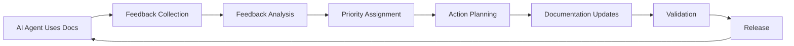

# Documentation Feedback Loops

## 🎯 Purpose
This framework establishes systematic feedback collection and processing for AI agent onboarding documentation, ensuring continuous improvement based on real usage patterns and pain points.

## 🔄 Feedback Loop Overview



## 📊 Feedback Collection Mechanisms

### 1. Automated Usage Analytics

#### Implementation Locations
```bash
# Add to validation script
scripts/validate-docs.sh
# Add analytics to GitHub Actions
.github/workflows/docs-validation.yml
# Usage tracking in documentation
docs/architecture/*.md (embedded analytics)
```

#### Metrics Collected
- **Page Views**: Which documentation files are accessed most
- **Command Execution**: Which code examples are run (via script tracking)
- **Error Rates**: Failed command executions from examples
- **Time on Page**: Duration of documentation reviews
- **Navigation Patterns**: Common documentation access paths
- **Search Patterns**: Internal documentation searches

#### Implementation
```javascript
// Embedded in documentation files (optional)
<!-- Analytics: Page view tracking -->
<script>
// Track documentation usage if GitHub Pages analytics available
</script>

<!-- Command execution tracking -->
```bash
# Add to examples where appropriate
echo "docs-usage: technical-specifications-example-1" >> /tmp/docs-usage.log
```

### 2. Explicit Feedback Collection

#### Feedback Collection Points
```markdown
<!-- Embed in each major documentation file -->
---
💡 **Feedback Request**
Was this section helpful? Report issues or suggestions:
- 🐛 [Report Documentation Bug](https://github.com/[org]/[repo]/issues/new?template=docs-bug.md&title=[DOC-BUG]%20[filename]:%20)
- ✨ [Suggest Enhancement](https://github.com/[org]/[repo]/issues/new?template=docs-enhancement.md&title=[DOC-ENHANCE]%20[filename]:%20)
- ⚡ [Quick Feedback Form](https://forms.gle/[quickform])
---
```

#### Feedback Types Tracked
1. **Bug Reports**: Incorrect information, broken examples, outdated commands
2. **Enhancement Requests**: Missing information, unclear explanations, suggested improvements
3. **Usage Patterns**: Which workflows are most/least used
4. **Confusion Points**: Where agents get stuck or need clarification
5. **Success Stories**: What works well and should be replicated
6. **Time-to-Productivity**: How quickly agents become productive

### 3. Structured Feedback Templates

#### GitHub Issue Templates

**Documentation Bug Template** (`.github/ISSUE_TEMPLATE/docs-bug.md`)
```markdown
---
name: Documentation Bug
about: Report incorrect or outdated documentation
title: '[DOC-BUG] [filename]: Brief description'
labels: ['documentation', 'bug']
assignees: ['docs-maintainer']
---

## 📍 Location
- **File**: `docs/architecture/[filename].md`
- **Section**: [section name]
- **Line/Example**: [specific location]

## 🐛 Problem Description
[Clear description of what's wrong]

## 🔍 Expected Information
[What should the documentation say instead]

## 💻 Environment
- **OS**: [Linux/macOS/Windows]
- **Python Version**: [version]
- **Poetry Version**: [version]
- **Last Working**: [if known]

## 📋 Reproduction Steps
[If applicable, steps to reproduce the issue]

## 📎 Additional Context
[Any other relevant information]
```

**Documentation Enhancement Template** (`.github/ISSUE_TEMPLATE/docs-enhancement.md`)
```markdown
---
name: Documentation Enhancement
about: Suggest improvements to documentation
title: '[DOC-ENHANCE] [filename]: Brief description'
labels: ['documentation', 'enhancement']
assignees: ['docs-maintainer']
---

## 📍 Location
- **File**: `docs/architecture/[filename].md`
- **Section**: [section name or "new section"]

## 💡 Enhancement Description
[Clear description of the suggested improvement]

## 🎯 Use Case
[Why is this enhancement needed? What problem does it solve?]

## 📝 Suggested Content
[Specific suggestions for new content, examples, or improvements]

## 🔗 Related Issues
[Links to related issues or discussions]

## 📊 Priority Level
- [ ] 🔴 Critical - Blocks agent productivity
- [ ] 🟡 Important - Improves agent efficiency
- [ ] 🟢 Nice-to-have - Quality of life improvement

## 📎 Additional Context
[Any other relevant information]
```

### 4. Automated Feedback Collection

#### Error Tracking Integration
```bash
# Add to validate-docs.sh
track_usage() {
    local action="$1"
    local file="$2"
    local status="$3"
    
    # Log to analytics file
    echo "$(date -Iseconds)|$action|$file|$status" >> /tmp/docs-analytics.log
    
    # Optional: Send to analytics service
    if [ "${DOCS_ANALYTICS_ENABLED:-false}" = "true" ]; then
        curl -s -X POST "${ANALYTICS_ENDPOINT}" \
            -H "Content-Type: application/json" \
            -d "{\"timestamp\":\"$(date -Iseconds)\",\"action\":\"$action\",\"file\":\"$file\",\"status\":\"$status\"}" || true
    fi
}

# Usage examples:
track_usage "validate_code" "quick-start-guide.md" "success"
track_usage "validate_code" "technical-specifications.md" "error"
```

## 🔍 Feedback Analysis Framework

### 1. Feedback Categorization

#### Categories
```yaml
bug_reports:
  severity:
    - critical: Blocks agent productivity
    - major: Causes significant confusion
    - minor: Small inaccuracies
  type:
    - broken_example: Code that doesn't work
    - outdated_info: Information no longer current
    - missing_context: Unclear or incomplete
    - broken_link: Dead links or references

enhancement_requests:
  priority:
    - high: Requested by multiple agents
    - medium: Improves specific workflow
    - low: Nice-to-have improvement
  scope:
    - new_content: Entirely new sections
    - expand_existing: Enhance current content
    - reorganization: Structural improvements
    - examples: More/better examples

usage_analytics:
  patterns:
    - high_traffic: Most accessed content
    - low_traffic: Rarely accessed content
    - high_error: Examples that frequently fail
    - quick_exit: Content with short engagement
```

### 2. Feedback Processing Workflow

#### Weekly Feedback Review (30 minutes)
```bash
# Automated feedback report generation
scripts/generate-feedback-report.sh weekly

# Manual review checklist:
# 1. Review new bug reports and classify by severity
# 2. Identify patterns in enhancement requests
# 3. Check usage analytics for trending issues
# 4. Update feedback backlog with priority levels
# 5. Schedule high-priority items for next maintenance cycle
```

#### Monthly Deep Analysis (2 hours)
```bash
# Generate comprehensive analytics
scripts/generate-feedback-report.sh monthly

# Analysis checklist:
# 1. Identify documentation usage patterns
# 2. Correlate feedback with usage analytics
# 3. Find systemic issues requiring larger changes
# 4. Update documentation strategy based on patterns
# 5. Plan quarterly documentation roadmap
```

#### Quarterly Strategic Review (4 hours)
```bash
# Full feedback analysis and planning
scripts/generate-feedback-report.sh quarterly

# Strategic review:
# 1. Analyze effectiveness of documentation changes
# 2. Identify gaps in onboarding experience
# 3. Plan major documentation improvements
# 4. Update feedback collection mechanisms
# 5. Revise documentation maintenance processes
```

## ⚡ Action Triggers and Responses

### 1. Immediate Action Triggers (≤ 24 hours)

#### Critical Bug Reports
```yaml
trigger_conditions:
  - severity: critical
  - affects: >50% of examples in a file
  - reported_by: multiple_agents
  - blocks: onboarding_workflow

response_actions:
  - create_hotfix_branch: "hotfix/docs-v{version}"
  - fix_immediately: true
  - test_fix: true
  - release_patch: "docs-v{major}.{minor}.{patch+1}-hotfix"
  - notify_team: ["docs-maintainer", "tech-lead"]
  - update_status: "resolved"
```

#### Broken Code Examples
```bash
# Immediate fix workflow
if [[ "$severity" == "critical" && "$type" == "broken_example" ]]; then
    # 1. Create hotfix branch
    git checkout -b "hotfix/docs-$(date +%Y%m%d)-broken-examples"
    
    # 2. Fix the example
    # Edit the problematic file
    
    # 3. Test the fix
    poetry run python -m pytest # or specific test
    scripts/validate-docs.sh
    
    # 4. Commit and release
    git add -A
    git commit -m "hotfix: fix broken code examples in [filename]"
    git tag -a "docs-v1.2.1-hotfix" -m "Critical fix for broken examples"
    
    # 5. Notify team
    echo "Critical documentation fix deployed" | scripts/notify-team.sh
fi
```

### 2. Weekly Action Triggers (≤ 7 days)

#### High-Priority Enhancements
```yaml
trigger_conditions:
  - priority: high
  - votes: ≥3
  - affects: core_workflow
  - effort: low_to_medium

response_actions:
  - schedule_for: next_maintenance_cycle
  - assign_to: docs_maintainer
  - create_branch: "feature/docs-enhancement-{issue_number}"
  - estimate_effort: planning_required
  - update_backlog: true
```

#### Pattern-Based Issues
```bash
# Weekly pattern analysis
if [[ "$pattern_frequency" -gt 3 ]]; then
    # Multiple reports of same issue
    echo "Pattern detected: $pattern_type in $file_location"
    
    # Prioritize for immediate attention
    gh issue create \
        --title "[PATTERN] Multiple reports: $pattern_type" \
        --body "Detected $pattern_frequency reports of similar issue" \
        --label "documentation,pattern,high-priority"
fi
```

### 3. Monthly Action Triggers (≤ 30 days)

#### Systemic Improvements
```yaml
trigger_conditions:
  - feedback_volume: high
  - affects_multiple: files
  - requires: structural_changes
  - impact: high

response_actions:
  - create_improvement_plan: true
  - schedule_major_version: consideration
  - gather_stakeholder_input: required
  - create_rfc: "RFC: Documentation Structure Improvement"
  - plan_implementation: quarterly_cycle
```

## 🔄 Integration with Existing Processes

### 1. Maintenance Checklist Integration

#### Enhanced Maintenance Triggers
```yaml
# Add to docs/architecture/documentation-maintenance-checklist.md

feedback_triggered_maintenance:
  immediate_triggers:
    - critical_bug_reports: ≥1
    - broken_examples: ≥2
    - blocking_issues: ≥1
  
  weekly_triggers:
    - minor_bug_reports: ≥5
    - enhancement_requests: ≥3
    - pattern_reports: ≥2
  
  monthly_triggers:
    - accumulated_feedback: ≥20_items
    - systemic_issues: ≥2
    - usage_pattern_changes: significant
```

#### Feedback Review Tasks
```markdown
# Add to monthly maintenance checklist

### Monthly Feedback Review
- [ ] Generate feedback analytics report
- [ ] Review and classify new feedback (30 min)
- [ ] Identify patterns and systemic issues (30 min)
- [ ] Update feedback response priorities (15 min)
- [ ] Schedule high-priority improvements (15 min)
- [ ] Update feedback collection mechanisms if needed (15 min)
```

### 2. Versioning Strategy Integration

#### Feedback-Driven Versioning
```yaml
# Add to docs/architecture/documentation-versioning-strategy.md

feedback_based_releases:
  patch_releases:
    - bug_fix_accumulation: ≥5_fixes
    - broken_example_fixes: ≥3_fixes
    - critical_hotfix: immediate
  
  minor_releases:
    - enhancement_accumulation: ≥10_enhancements
    - new_section_requests: ≥3_similar_requests
    - workflow_improvements: significant
  
  major_releases:
    - structural_changes: required
    - fundamental_workflow_changes: multiple
    - architecture_documentation_gaps: systemic
```

### 3. Automation Integration

#### Enhanced Validation Script
```bash
# Add feedback-aware validation to scripts/validate-docs.sh

validate_with_feedback() {
    log_section "📊 Validating Based on Recent Feedback"
    
    # Check recently reported issues
    check_known_issues
    
    # Validate recently enhanced sections more thoroughly
    validate_enhanced_sections
    
    # Test examples that were recently fixed
    test_recently_fixed_examples
    
    # Generate feedback-aware report
    generate_feedback_report
}

check_known_issues() {
    # Read recent issues from GitHub API or local cache
    if [ -f "/tmp/recent-doc-issues.json" ]; then
        log_info "Checking validation against recent issues..."
        # Parse and validate specific reported problems
    fi
}
```

## 📈 Success Metrics and KPIs

### 1. Feedback Volume Metrics
```yaml
healthy_feedback_patterns:
  bug_reports:
    - monthly_volume: 5-15 reports
    - resolution_rate: ≥90% within 30 days
    - critical_resolution: ≤24 hours
  
  enhancement_requests:
    - monthly_volume: 10-25 requests
    - implementation_rate: ≥60% within 90 days
    - user_satisfaction: ≥80%

  usage_analytics:
    - engagement_improvement: month_over_month
    - error_rate_reduction: quarterly_trend
    - time_to_productivity: ≤30 minutes target
```

### 2. Documentation Quality Metrics
```yaml
quality_indicators:
  accuracy:
    - broken_example_reports: ≤2 per month
    - outdated_information: ≤5 reports per quarter
    - validation_success_rate: ≥95%
  
  completeness:
    - missing_information_requests: trending_down
    - new_workflow_coverage: ≤14 days from code to docs
    - cross_reference_accuracy: ≥98%
  
  usability:
    - confusion_point_reports: trending_down
    - positive_feedback_ratio: ≥70%
    - quick_start_success_rate: ≥85%
```

### 3. Response Effectiveness Metrics
```yaml
response_metrics:
  resolution_speed:
    - critical_issues: ≤24 hours
    - high_priority: ≤7 days
    - medium_priority: ≤30 days
    - low_priority: ≤90 days
  
  quality_improvement:
    - repeat_issue_rate: ≤10%
    - enhancement_satisfaction: ≥80%
    - documentation_accuracy: trending_up
```

## 🛠️ Implementation Plan

### Week 1: Setup Feedback Collection
- [ ] Create GitHub issue templates
- [ ] Add feedback collection sections to documentation
- [ ] Set up basic analytics tracking
- [ ] Create feedback processing scripts

### Week 2: Analysis Framework
- [ ] Implement feedback categorization system
- [ ] Create automated reporting scripts
- [ ] Set up monitoring dashboards
- [ ] Define response workflows

### Week 3: Integration
- [ ] Integrate with maintenance checklist
- [ ] Update versioning strategy
- [ ] Enhance validation scripts
- [ ] Create response automation

### Week 4: Testing and Refinement
- [ ] Test feedback collection mechanisms
- [ ] Validate analysis workflows
- [ ] Refine response triggers
- [ ] Document feedback loop processes

## 🔗 Related Documents
- [Documentation Maintenance Checklist](./documentation-maintenance-checklist.md)
- [Documentation Versioning Strategy](./documentation-versioning-strategy.md)
- [Troubleshooting Guide](./troubleshooting-guide.md)
- [AI Agent Workflows](./ai-agent-workflows.md)

---

*This feedback loop framework ensures documentation continuously improves based on real agent usage patterns and needs, creating a self-improving documentation ecosystem.* 