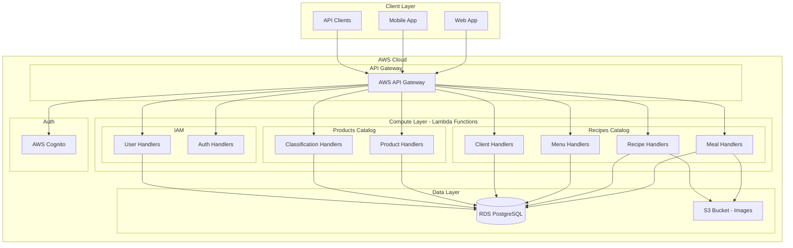
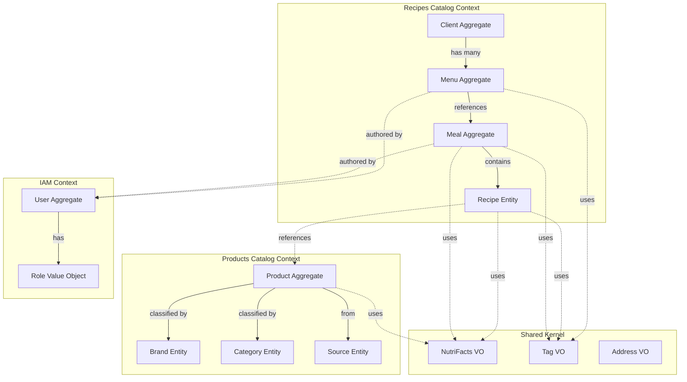
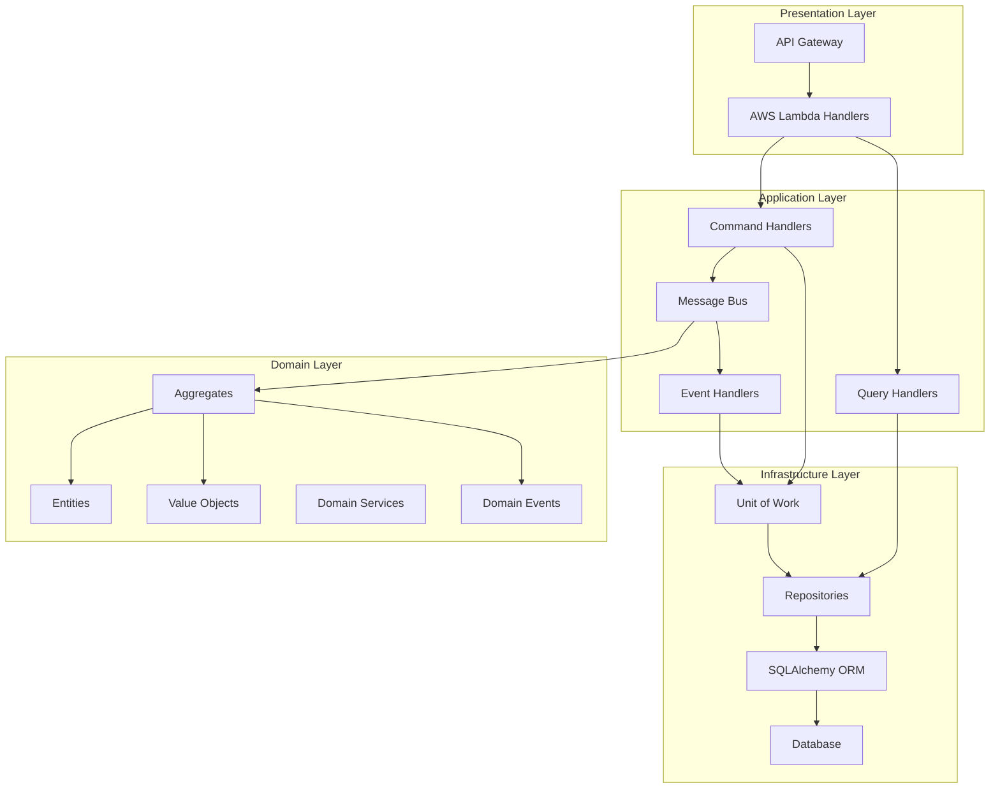
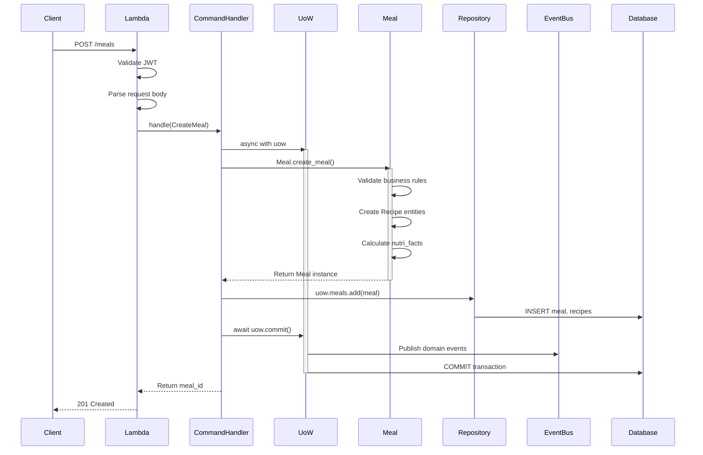
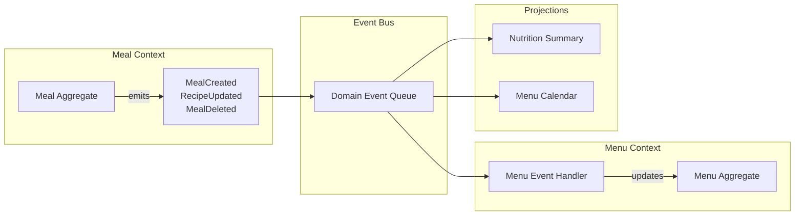
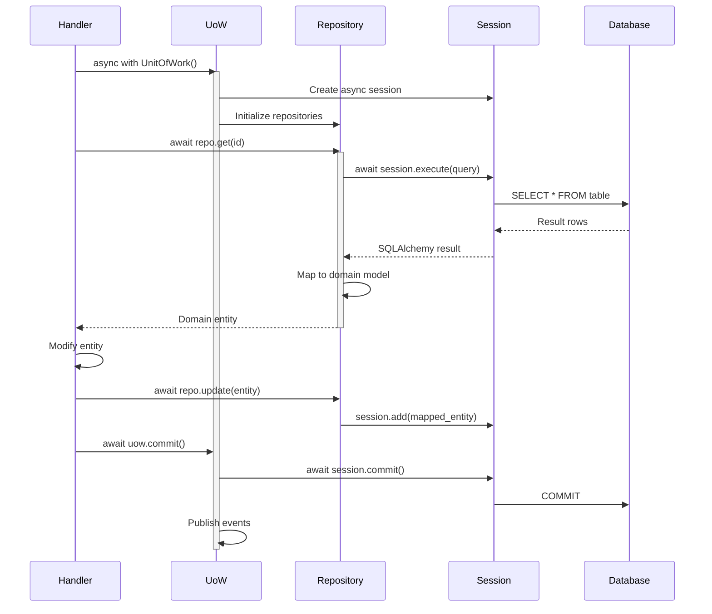
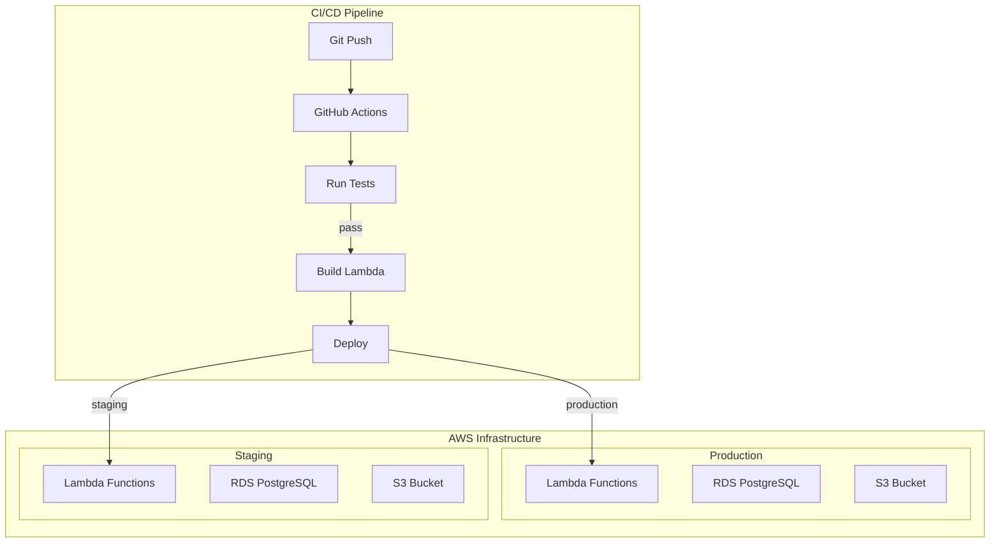
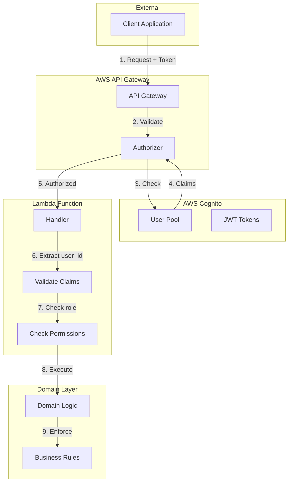

# System Architecture Diagrams

## High-Level System Architecture



## Domain Model - Bounded Contexts



## Aggregate Boundaries - Meal and Recipe

```mermaid
graph TB
    subgraph "Meal Aggregate Root"
        MEAL_ROOT[Meal<br/>- id: UUID<br/>- name: str<br/>- author_id: UUID<br/>- menu_id: UUID<br/>- version: int]
        
        subgraph "Public API"
            CREATE_RECIPE[create_recipe()]
            UPDATE_RECIPES[update_recipes()]
            DELETE_RECIPE[delete_recipe()]
            COPY_RECIPE[copy_recipe()]
        end
        
        subgraph "Cached Properties"
            NUTRI_FACTS[nutri_facts<br/>@cached_property]
            MACRO_DIV[macro_division<br/>@cached_property]
            TOTAL_WEIGHT[total_weight<br/>@cached_property]
        end
    end
    
    subgraph "Recipe Entity"
        RECIPE_ENTITY[Recipe<br/>- id: UUID<br/>- meal_id: UUID<br/>- name: str<br/>- instructions: str<br/>- nutri_facts: NutriFacts]
        
        subgraph "Protected Setters"
            SET_NAME[_set_name()]
            SET_INSTRUCT[_set_instructions()]
            SET_NUTRI[_set_nutri_facts()]
        end
        
        subgraph "Direct Actions"
            RATE[rate()]
            DELETE_RATE[delete_rate()]
        end
    end
    
    MEAL_ROOT --> CREATE_RECIPE
    MEAL_ROOT --> UPDATE_RECIPES
    MEAL_ROOT --> DELETE_RECIPE
    MEAL_ROOT --> COPY_RECIPE
    
    CREATE_RECIPE -->|creates| RECIPE_ENTITY
    UPDATE_RECIPES -->|calls| SET_NAME
    UPDATE_RECIPES -->|calls| SET_INSTRUCT
    UPDATE_RECIPES -->|calls| SET_NUTRI
    
    UPDATE_RECIPES -->|invalidates| NUTRI_FACTS
    UPDATE_RECIPES -->|invalidates| MACRO_DIV
    UPDATE_RECIPES -->|invalidates| TOTAL_WEIGHT
```

## Layered Architecture



## Command Flow - Create Meal Example



## Event-Driven Architecture



## Caching Strategy

```mermaid
graph TB
    subgraph "Entity Instance"
        ENTITY[Entity Base Class]
        CACHED_ATTRS[_cached_attrs: set]
        
        subgraph "Cached Properties"
            PROP1[@cached_property<br/>nutri_facts]
            PROP2[@cached_property<br/>macro_division]
            PROP3[@cached_property<br/>average_rating]
        end
        
        subgraph "Cache Management"
            INVALIDATE[_invalidate_caches()]
            CHECK_CACHE[Check if cached]
            COMPUTE[Compute value]
            STORE[Store in cache]
        end
    end
    
    subgraph "Mutation Flow"
        MUTATE[Mutation method]
        UPDATE_STATE[Update state]
        INCREMENT_VER[_increment_version()]
        CLEAR_CACHE[Clear affected caches]
    end
    
    ENTITY --> CACHED_ATTRS
    ENTITY --> PROP1
    ENTITY --> PROP2
    ENTITY --> PROP3
    
    PROP1 --> CHECK_CACHE
    CHECK_CACHE -->|miss| COMPUTE
    COMPUTE --> STORE
    CHECK_CACHE -->|hit| RETURN[Return cached value]
    
    MUTATE --> UPDATE_STATE
    UPDATE_STATE --> INCREMENT_VER
    INCREMENT_VER --> CLEAR_CACHE
    CLEAR_CACHE --> INVALIDATE
```

## Repository Pattern with Async/Await



## Database Schema Overview

```mermaid
erDiagram
    MEALS {
        uuid id PK
        string name
        uuid author_id FK
        uuid menu_id FK
        text description
        text notes
        boolean discarded
        int version
        timestamp created_at
        timestamp updated_at
    }
    
    RECIPES {
        uuid id PK
        uuid meal_id FK
        string name
        text instructions
        jsonb nutri_facts
        int servings
        int prep_time_minutes
        int cook_time_minutes
        uuid author_id FK
        boolean discarded
        int version
    }
    
    INGREDIENTS {
        uuid id PK
        uuid recipe_id FK
        uuid product_id FK
        decimal amount
        string unit
        string preparation
        int position
    }
    
    MENUS {
        uuid id PK
        uuid author_id FK
        uuid client_id FK
        text description
        boolean discarded
        int version
    }
    
    MENU_MEALS {
        uuid id PK
        uuid menu_id FK
        uuid meal_id FK
        int week
        string weekday
        string meal_type
        string meal_name
        jsonb nutri_facts
    }
    
    PRODUCTS {
        uuid id PK
        string name
        uuid brand_id FK
        uuid source_id FK
        jsonb nutri_facts_per_100g
        string barcode
        text ingredients_text
        jsonb allergens
    }
    
    MEALS ||--o{ RECIPES : contains
    RECIPES ||--o{ INGREDIENTS : has
    INGREDIENTS }o--|| PRODUCTS : uses
    MENUS ||--o{ MENU_MEALS : contains
    MENU_MEALS }o--|| MEALS : references
```



## Testing Strategy

```mermaid
graph TB
    subgraph "Test Pyramid"
        UNIT[Unit Tests<br/>Domain Logic]
        INTEGRATION[Integration Tests<br/>Repositories, Services]
        E2E[E2E Tests<br/>Lambda Handlers]
    end
    
    subgraph "Test Focus Areas"
        BEHAVIOR[Behavior Tests<br/>What it does]
        CACHE[Cache Tests<br/>Performance & Invalidation]
        BOUNDARY[Boundary Tests<br/>Edge cases]
        PERF[Performance Tests<br/>Benchmarks]
    end
    
    subgraph "Test Patterns"
        FACTORIES[Test Factories<br/>create_meal()]
        FIXTURES[Fixtures<br/>Database state]
        MOCKS[Mocks<br/>External services]
        PARAMS[Parametrized<br/>Multiple scenarios]
    end
    
    UNIT --> BEHAVIOR
    UNIT --> CACHE
    UNIT --> BOUNDARY
    
    INTEGRATION --> FIXTURES
    INTEGRATION --> FACTORIES
    
    E2E --> MOCKS
    
    BOUNDARY --> PARAMS
    PERF --> CACHE
```

## Deployment Architecture



## Security Architecture



These diagrams provide a comprehensive visual representation of the system architecture, making it easier for AI agents to understand the structure, relationships, and flow of the application.