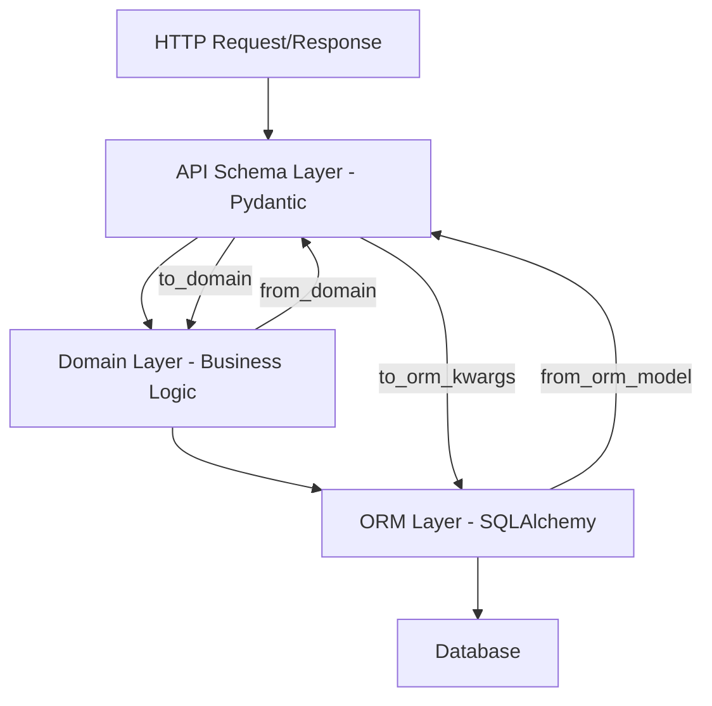

# PRD: API Schema Documentation Update

## Executive Summary

### Problem Statement
The current documentation lacks comprehensive explanation of Pydantic API classes and their critical role in data conversion between API, domain, and ORM layers. This gap causes confusion for AI agents and developers about how to properly implement the four conversion methods (`to_domain`, `from_domain`, `from_orm_model`, `to_orm_kwargs`) and handle type mismatches between layers.

### Proposed Solution
Enhance the documentation by adding a new "API Schema Pattern" to the pattern library, updating technical specifications with data layer conversion details, and documenting common confusion points about API/domain/ORM conversions.

### Business Value
- Reduce onboarding time for new developers and AI agents
- Prevent bugs caused by incorrect layer conversions
- Improve code consistency across the codebase
- Enable faster feature development with clear patterns

### Success Criteria
- 100% of developers can implement API schema conversions without assistance
- Zero confusion points reported about API/domain/ORM relationships
- All new API schemas follow documented patterns correctly
- Testing synchronization between layers becomes standard practice

## Goals and Non-Goals

### Goals
1. Document the complete API Schema pattern with all four conversion methods
2. Explain type conversion handling between layers (set ↔ frozenset ↔ list)
3. Clarify computed properties vs actual attributes across layers
4. Provide testing strategies for layer synchronization
5. Add concrete examples from the existing codebase
6. Create clear decision guidance for when to use each pattern

### Non-Goals (Out of Scope)
1. Refactoring existing API schemas to match new patterns
2. Changing the underlying architecture or base classes
3. Creating automated tooling for schema generation
4. Modifying the ORM layer implementation
5. Creating video tutorials or interactive documentation

## User Stories and Acceptance Criteria

### User Story 1: Understanding API Schema Purpose
**As a** developer/AI agent
**I want to** understand why Pydantic API classes exist
**So that** I can implement proper data validation and conversion

**Acceptance Criteria:**
- [ ] Clear explanation of three-layer architecture (API/Domain/ORM)
- [ ] Visual diagram showing data flow between layers
- [ ] Rationale for separation of concerns
- [ ] Benefits of type safety at API boundary

### User Story 2: Implementing Conversion Methods
**As a** developer/AI agent
**I want to** implement the four conversion methods correctly
**So that** data flows properly between system layers

**Acceptance Criteria:**
- [ ] Step-by-step guide for each conversion method
- [ ] Working examples for simple and complex scenarios
- [ ] Error handling patterns documented
- [ ] Common pitfalls identified and solutions provided

### User Story 3: Handling Type Mismatches
**As a** developer/AI agent
**I want to** handle type differences between layers
**So that** the system maintains data integrity

**Acceptance Criteria:**
- [ ] Documentation of common type mismatches
- [ ] Conversion strategies for collections (set/frozenset/list)
- [ ] Handling of computed vs stored properties
- [ ] Examples from real codebase scenarios

### User Story 4: Testing Layer Synchronization
**As a** developer/AI agent
**I want to** test that all layers stay synchronized
**So that** changes don't break data flow

**Acceptance Criteria:**
- [ ] Testing patterns for conversion methods
- [ ] Examples of synchronization tests
- [ ] Common test failures and fixes
- [ ] Integration with existing test infrastructure

## Technical Specifications

### System Architecture
The API Schema pattern follows a three-layer architecture:



### Data Model
```yaml
BaseApiModel:
  Abstract Methods:
    - from_domain(cls, obj: D) -> Self
    - to_domain(self) -> D
    - from_orm_model(cls, obj: S) -> Self
    - to_orm_kwargs(self) -> dict[str, Any]
  
  Helper Methods:
    - _safe_from_domain(cls, obj: D) -> Self
    - _safe_to_domain(self) -> D
    - _safe_from_orm_model(cls, obj: S) -> Self
    - _safe_to_orm_kwargs(self) -> dict[str, Any]

Inheritance Hierarchy:
  - BaseApiModel[D, S]
    - BaseEntity[D, S]
    - BaseValueObject[D]
    - BaseCommand[D]
```

### API Specifications
```yaml
Pattern Examples:
  Simple Entity:
    from_domain: Direct field mapping
    to_domain: Constructor with field values
    from_orm_model: Map ORM fields to API fields
    to_orm_kwargs: Return dict for ORM updates

  Complex Aggregate:
    from_domain: Handle nested objects and collections
    to_domain: Recursive conversion of nested objects
    from_orm_model: Load relationships and convert
    to_orm_kwargs: Handle relationship updates

  Value Object:
    from_domain: Map immutable fields
    to_domain: Create frozen instance
    from_orm_model: Not typically used
    to_orm_kwargs: Return simple dict
```

## Functional Requirements

### FR1: Add API Schema Pattern to Pattern Library
**Description:** Create comprehensive pattern documentation in pattern-library.md
**Priority:** P0
**Dependencies:** None

**Content Requirements:**
- Pattern overview and purpose
- When to use vs other patterns
- Implementation examples for each conversion method
- Type conversion strategies
- Error handling patterns
- Testing approaches

### FR2: Update Technical Specifications
**Description:** Add "Data Layer Conversions" section to technical-specifications.md
**Priority:** P0
**Dependencies:** FR1 completion

**Content Requirements:**
- Three-layer architecture explanation
- Type system mapping between layers
- Computed property handling
- Performance considerations
- Transaction boundaries

### FR3: Document Common Confusion Points
**Description:** Add API/domain/ORM conversion confusion to common-confusion-points.md
**Priority:** P1
**Dependencies:** FR1, FR2 completion

**Content Requirements:**
- Common implementation mistakes
- Type mismatch scenarios
- Testing synchronization issues
- Troubleshooting guide

### FR4: Create Cross-References
**Description:** Add navigation links between related documentation
**Priority:** P1
**Dependencies:** FR1, FR2, FR3 completion

**Content Requirements:**
- Links from Lambda Handler pattern to API Schema pattern
- References in Quick Start Guide
- Updates to documentation index

## Non-Functional Requirements

### Documentation Quality Requirements
- Clear, concise writing following existing style
- Working code examples that can be copy-pasted
- Consistent terminology across all documents
- Progressive complexity from simple to advanced

### Accessibility Requirements
- Markdown formatting compatible with screen readers
- Clear heading hierarchy
- Descriptive link text
- Alt text for any diagrams

### Maintenance Requirements
- Examples must be tested against current codebase
- Documentation versioned with code changes
- Clear update process documented

## Risk Assessment

### Risk Matrix
| Risk | Probability | Impact | Mitigation Strategy |
|------|------------|--------|-------------------|
| Examples become outdated | High | Medium | Include in CI/CD validation |
| Over-complex documentation | Medium | High | Get feedback from junior developers |
| Incomplete coverage | Low | High | Review with senior developers |
| Conflicting patterns | Low | Medium | Align with architecture team |

### Technical Risks
1. **Documentation Drift**
   - Description: Code changes without documentation updates
   - Impact: Confusion and incorrect implementations
   - Mitigation: Add documentation checks to PR process

2. **Pattern Misuse**
   - Description: Developers use patterns incorrectly
   - Impact: Bugs and maintenance issues
   - Mitigation: Provide clear "when to use" guidance

## Testing Strategy

### Documentation Validation
- All code examples must compile and run
- Examples tested against current test suite
- Links validated for correctness

### User Testing
- Have 2-3 developers implement features using only new documentation
- Collect feedback on clarity and completeness
- Iterate based on confusion points

## Implementation Plan

### Phase 0: Prerequisites (1 day)
- [x] Analyze existing API schemas for patterns
- [x] Identify key examples to document
- [ ] Review plan with architecture team
- [ ] Set up documentation testing framework

### Phase 1: Pattern Library Update (2 days)
- [ ] Write API Schema Pattern section
- [ ] Add simple entity example
- [ ] Add complex aggregate example
- [ ] Add value object example
- [ ] Add error handling patterns
- [ ] Add testing patterns

### Phase 2: Technical Specifications Update (1 day)
- [ ] Write Data Layer Conversions section
- [ ] Add architecture diagrams
- [ ] Document type mappings
- [ ] Add performance considerations

### Phase 3: Common Confusion Points Update (1 day)
- [ ] Document API/domain/ORM confusion
- [ ] Add troubleshooting guide
- [ ] Create quick reference table
- [ ] Add prevention strategies

### Phase 4: Integration and Review (1 day)
- [ ] Add cross-references between documents
- [ ] Update documentation index
- [ ] Test all examples
- [ ] Get peer review
- [ ] Make final adjustments

### Rollout Strategy
- Direct documentation update (no feature flags needed)
- Announce in team channels
- Include in next onboarding session

## Monitoring and Observability

### Key Metrics
- Documentation page views
- Time spent on pages
- Search queries for API schema topics
- Support questions about conversions

### Feedback Collection
- GitHub issues for documentation problems
- Quarterly documentation review
- Onboarding session feedback

## Documentation Requirements

### Technical Documentation
- [x] Pattern library entry
- [x] Technical specifications update
- [x] Common confusion points entry
- [ ] Example repository with working code

### Review Process
- [ ] Technical review by senior developer
- [ ] Copy editing for clarity
- [ ] Testing by junior developer
- [ ] AI agent testing

## Dependencies and Prerequisites

### Technical Dependencies
- Access to current codebase for examples
- Understanding of existing patterns
- Markdown rendering tools

### Team Dependencies
- Architecture team review
- Senior developer input
- Technical writer review (if available)

## Timeline and Milestones

### Estimated Timeline
- Phase 0: 1 day
- Phase 1: 2 days
- Phase 2: 1 day
- Phase 3: 1 day
- Phase 4: 1 day
- **Total**: 6 days

### Key Milestones
- Pattern Library Draft Complete: Day 3
- Technical Specs Updated: Day 4
- Full Documentation Ready: Day 5
- Review and Launch: Day 6

## Open Questions and Decisions

### Open Questions
1. Should we include performance benchmarks for conversions?
2. Do we need video tutorials for complex scenarios?
3. Should we create a separate API schema cookbook?

### Pending Decisions
1. Naming convention for test files
   - Options: [test_api_sync.py, test_layer_conversion.py, test_api_mapping.py]
   - Recommendation: test_api_sync.py (clear purpose)

2. Documentation location for examples
   - Options: [Inline in docs, separate examples directory, both]
   - Recommendation: Both (inline for quick reference, directory for full examples)

### Required Approvals
- [ ] Technical Architecture: Architecture Team Lead
- [ ] Documentation Quality: Senior Developer
- [ ] Business Value: Product Owner

## Quality Checklist

Before finalizing the documentation updates:
- [ ] All examples compile and run successfully
- [ ] Type conversions are clearly explained
- [ ] Error handling is comprehensive
- [ ] Testing patterns are practical
- [ ] Navigation between documents is smooth
- [ ] Confusion points are addressed
- [ ] Examples represent real-world usage
- [ ] Documentation follows team style guide