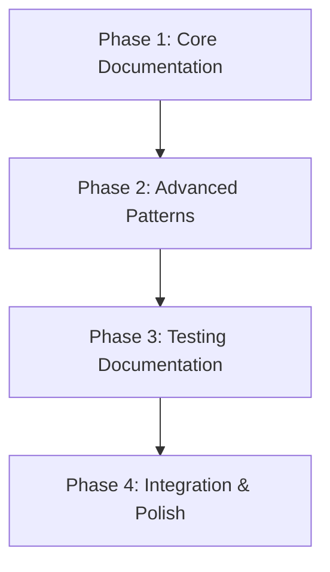

# Implementation Guide: API Layer Documentation

---
feature: api-layer-documentation
complexity: standard
risk_level: low
estimated_time: 20-30 hours
phases: 4
---

## Overview
Create comprehensive, step-by-step documentation for the menu-planning project's API layer architecture that explains patterns, implementation guidance, and testing strategies specifically optimized for AI coding agents and developer onboarding.

## Architecture
Following "Architecture Patterns with Python" with async/ORM adaptations:
- **API Layer**: Pydantic v2 models as adapters between domain and external interfaces
- **Domain Integration**: Command/Entity/ValueObject pattern inheritance
- **Type Conversion**: Utilities for Domain UUID ↔ API string, Set ↔ FrozenSet transformations
- **AWS Lambda Flow**: event → JSON → ApiCommand → Domain → MessageBus

## Files to Create
### Core Documentation Files
- `docs/api-layer/overview.md` - Architecture overview and purpose (NEW)
- `docs/api-layer/implementation-guide.md` - Step-by-step implementation patterns (NEW)
- `docs/api-layer/testing-guide.md` - TDD approaches and testing patterns (NEW)
- `docs/api-layer/integration-patterns.md` - AWS Lambda and domain integration (NEW)
- `docs/api-layer/examples/` - Working code examples directory (NEW)

### Supporting Files
- `docs/api-layer/examples/command-examples.py` - Command implementation examples (NEW)
- `docs/api-layer/examples/entity-examples.py` - Entity implementation examples (NEW)
- `docs/api-layer/examples/value-object-examples.py` - Value object examples (NEW)
- `docs/api-layer/examples/test-examples.py` - Comprehensive testing examples (NEW)

## Testing Strategy
- **Documentation Validation**: Automated testing of all code examples
- **Pattern Verification**: Ensure documented patterns match codebase implementation
- **Commands**: 
  - `poetry run python -m pytest docs/api-layer/examples/ -v`
  - `poetry run python -m doctest docs/api-layer/examples/*.py`
- **Coverage target**: 100% of code examples must execute correctly

## Phase Dependencies


## Key Technical Patterns to Document

### BaseApiModel Configuration
```python
# Pydantic v2 with frozen/strict config
class BaseApiModel(BaseModel):
    model_config = ConfigDict(
        # SECURITY & INTEGRITY SETTINGS
        frozen=True,                 # Make models immutable - prevents accidental mutation
        strict=True,                # Enable strict type validation - NO automatic conversions
        extra='forbid',             # Forbid extra fields - prevents injection attacks
        validate_assignment=True,    # Validate assignment - ensures consistency after creation
        
        # CONVERSION & COMPATIBILITY SETTINGS  
        from_attributes=True,       # Convert from attributes to fields - enables ORM integration
        populate_by_name=True,      # Allow population by field name - supports multiple naming
        use_enum_values=True,       # Use enum values instead of enum objects - API consistency
        
        # VALIDATION BEHAVIOR SETTINGS
        validate_default=True,      # Validate default values - ensures defaults are correct
        str_strip_whitespace=True,  # Strip whitespace from strings - data cleansing
        
        # SERIALIZATION SETTINGS
        alias_generator=None,       # Can be overridden in subclasses for custom naming
        
        # PERFORMANCE SETTINGS
        arbitrary_types_allowed=False,  # Disallow arbitrary types - forces explicit validation
        revalidate_instances='never'    # Performance optimization for immutable objects
    )
```

### Domain Conversion Methods
- Commands: `to_domain()` method, `from_api_<entity>()` classmethod for updates
- Entities: `from_domain()`, `custom_dump_json()`, `to_domain()`, `to_orm_kwargs()`
- Value Objects: Same as entities but emphasizing immutability

## Risk Mitigation
- **Code Examples Outdating**: Version control integration and automated testing
- **Pattern Misalignment**: Regular validation against actual codebase
- **AI Agent Confusion**: Clear, consistent naming and extensive examples
- **Maintenance Overhead**: Focus on essential patterns, automate validation

## Success Criteria
1. **AI Agent Accuracy**: >85% correct pattern generation in tests
2. **Documentation Completeness**: 100% API class types covered with examples
3. **Code Quality**: All examples executable and following project conventions
4. **Developer Onboarding**: 50% reduction in time to create first API class
5. **Pattern Consistency**: Standardized implementation across all API classes

## Quality Gates
- All code examples must compile and execute
- Documentation must validate against current codebase patterns
- Conversion utilities must handle edge cases properly

## AI Agent Optimization Focus
- Pattern recognition through consistent naming
- Sufficient context for understanding relationships
- Clear constraints and limitations
- Working examples for every documented pattern 