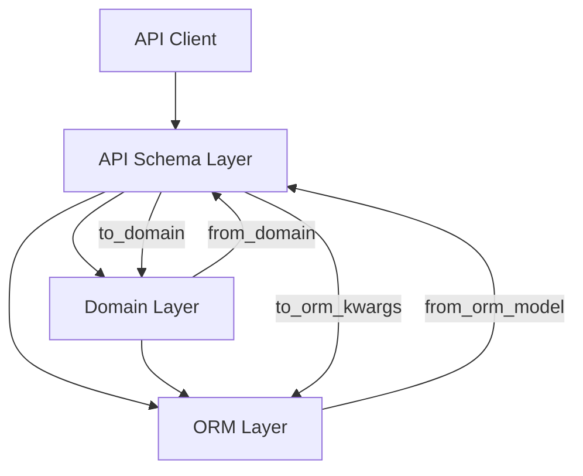

# PRD: API Schema Pattern Documentation Enhancement

## Executive Summary

### Problem Statement
AI agents (primarily Claude-4-Sonnet via Cursor) struggle with implementing Pydantic API schemas correctly due to insufficient documentation of the four-layer conversion pattern (`to_domain`, `from_domain`, `from_orm_model`, `to_orm_kwargs`) and complex type handling between domain, API, and ORM layers. This leads to repeated errors, inefficient development cycles, and inconsistent implementations.

**Current Problematic Patterns:**
- **Type Inconsistencies**: Domain uses `set[Tag]`, API uses `frozenset[ApiTag]`, ORM uses `list[TagSaModel]` without clear conversion guidelines
- **Computed Property Confusion**: `nutri_facts` is a `@cached_property` in domain, regular attribute in API, and composite field in ORM with no documentation explaining the pattern
- **Validator Documentation Gap**: Fields like `MealName` use `BeforeValidator(validate_optional_text)` with no docstring explaining why this specific validation is needed
- **TypeAdapter Performance Issues**: TypeAdapters recreated multiple times instead of following Pydantic's singleton pattern, causing performance degradation
- **Missing Error Handling**: No clear guidance on what happens when type conversions fail between layers

### Proposed Solution
Create comprehensive documentation focused on the "API Schema Pattern" that provides clear guidance on immutable Pydantic API class implementation, type conversion strategies, computed properties handling, SQLAlchemy composite type integration, and testing patterns for synchronizing domain and ORM models.

### Business Value
- **Reduced Development Time**: 40-60% faster API schema implementation by AI agents
- **Improved Code Quality**: Consistent implementation patterns across all API schemas
- **Lower Maintenance Cost**: Fewer bugs related to type mismatches and conversion errors
- **Better Onboarding**: New developers and AI agents can understand patterns quickly

### Success Criteria
- AI agents can implement new API schemas without asking clarifying questions in 90% of cases
- Zero type conversion errors in newly implemented API schemas
- 50% reduction in PR review cycles for API schema changes
- All existing API schemas can be refactored to follow documented patterns

## Goals and Non-Goals

### Goals
1. Document the four-layer conversion pattern with clear examples and rationale
2. Provide type conversion strategies for common scenarios (set ↔ frozenset ↔ list)
3. Clarify computed properties vs stored attributes handling across layers
4. Document SQLAlchemy composite type integration patterns
5. Create testing patterns for domain-ORM synchronization
6. Provide decision trees for choosing appropriate patterns

### Non-Goals (Out of Scope)
1. Rewriting existing API schema implementations
2. Creating automated code generation tools
3. Documenting general Pydantic usage (focus on project-specific patterns)
4. Performance optimization strategies
5. API versioning or backwards compatibility patterns

## User Stories and Acceptance Criteria

### User Story 1: AI Agent Implements New API Schema
**As an** AI agent (Claude via Cursor)
**I want to** understand the API schema pattern documentation
**So that** I can correctly implement new API schemas without errors

**Acceptance Criteria:**
- [ ] Documentation clearly explains when to use each of the four methods with decision flowchart
- [ ] Examples show complete implementation for simple and complex entities (minimum 3 real examples from codebase)
- [ ] Type conversion patterns are explicitly documented with before/after code examples
- [ ] Common pitfalls and their solutions are highlighted with error scenarios
- [ ] AI agent can implement new schema without asking questions in 90% of test cases
- [ ] All code examples are executable and pass validation tests

### User Story 2: Developer Handles Computed Properties
**As a** backend developer
**I want to** understand how to handle computed properties
**So that** I can correctly implement properties that exist in domain but not in ORM

**Acceptance Criteria:**
- [ ] Clear distinction between computed and stored properties
- [ ] Examples of properties computed in domain but materialized in API
- [ ] Testing strategies for computed property synchronization
- [ ] Decision guide for when to compute vs store

### User Story 3: AI Agent Manages Type Conversions
**As an** AI agent
**I want to** understand type conversion patterns
**So that** I can handle set/frozenset/list conversions correctly

**Acceptance Criteria:**
- [ ] Conversion matrix showing all type transformations
- [ ] TypeAdapter usage patterns with caching strategies
- [ ] Examples for nested collection conversions
- [ ] Performance considerations documented

## Technical Specifications

### System Architecture
The API Schema Pattern operates within a three-layer architecture:



### Concrete Examples from Current Codebase

#### Example 1: Type Conversion Patterns (Tags)
**Current Implementation Analysis:**
```python
# Domain Layer (meal.py:297)
@property
def tags(self) -> set[Tag]:  # Uses set
    return self._tags

# API Layer (api_meal.py:48,70-72)
tags: MealTags  # MealTags = frozenset[ApiTag]
@field_validator('tags')
def validate_tags(cls, v: frozenset[ApiTag]) -> frozenset[ApiTag]:
    return TagFrozensetAdapter.validate_python(v)  # Uses TypeAdapter

# ORM Layer (meal_sa_model.py:36-40)
tags: Mapped[list[TagSaModel]] = relationship(  # Uses list via relationship
    secondary=meals_tags_association,
    lazy="selectin",
)
```

**Type Conversion Flow:**
- **Domain → API**: `frozenset(ApiTag.from_domain(t) for t in domain_obj.tags)` (line 83)
- **API → Domain**: `set(t.to_domain() for t in self.tags)` (line 108)
- **ORM → API**: `frozenset(ApiTag.from_orm_model(t) for t in orm_model.tags)` (line 128)
- **API → ORM**: `[t.to_orm_kwargs() for t in self.tags]` (line 153)

#### Example 2: Computed Properties vs Stored Attributes (NutriFacts)
**Current Implementation Analysis:**
```python
# Domain Layer (meal.py:313-346)
@cached_property
def nutri_facts(self) -> NutriFacts | None:
    """Calculate aggregated nutritional facts - COMPUTED at runtime"""
    nutri_facts = NutriFacts()
    has_any_nutri_facts = False
    for recipe in self.recipes:
        if recipe.nutri_facts is not None:
            nutri_facts += recipe.nutri_facts  # Aggregation logic
            has_any_nutri_facts = True
    return nutri_facts if has_any_nutri_facts else None

# API Layer (api_meal.py:53)
nutri_facts: MealNutriFacts  # Regular attribute - MATERIALIZED value

# ORM Layer (meal_sa_model.py:47-68)
nutri_facts: Mapped[NutriFactsSaModel] = composite(  # COMPOSITE type
    *[mapped_column(field.name, index=...) for field in fields(NutriFactsSaModel)]
)
```

**Key Insight**: Domain computes on-demand, API materializes the computed value, ORM stores as composite

#### Example 3: Field Validation with Documentation Gap
**Current Implementation Analysis:**
```python
# Field Definition (api_meal_fields.py)
MealName = Annotated[
    str,
    BeforeValidator(validate_optional_text),  # WHY THIS VALIDATOR?
    Field(..., min_length=1, max_length=255, description="Name of the meal"),
]

# Validator Function (base_api_fields.py)
def validate_optional_text(v: str | None) -> str | None:
    """Validate optional text: trim whitespace and return None if empty."""
    if v is None:
        return None
    trimmed = v.strip()
    if not trimmed:  # Empty string after trimming
        return None
    return trimmed
```

**Documentation Gap**: No explanation of WHY BeforeValidator is needed for required field

### Data Model
```yaml
API Schema Structure:
  Base Class: BaseEntity[D, S]
  Type Parameters:
    - D: Domain type (Entity, ValueObject, Command)
    - S: SQLAlchemy ORM type
  
  Required Methods:
    - to_domain() -> D
    - from_domain(domain_obj: D) -> Self
    - from_orm_model(orm_model: S) -> Self
    - to_orm_kwargs() -> Dict[str, Any]
  
  Field Types:
    - Immutable collections: frozenset
    - JSON serializable: list (via field_serializer)
    - Validation: TypeAdapter with caching
```

### API Specifications
```yaml
Pattern: Four-Layer Conversion
Methods:
  to_domain:
    Purpose: Convert API request data to domain object
    Usage: Command/Query creation from client input
    Validation: Business rules applied
  
  from_domain:
    Purpose: Convert domain object to API response
    Usage: Serialize domain data for client
    Transformation: Materialize computed properties
  
  from_orm_model:
    Purpose: Convert ORM query result to API schema
    Usage: Testing and data migration only
    Note: Bypass domain layer for performance
  
  to_orm_kwargs:
    Purpose: Generate ORM model creation arguments
    Usage: Testing domain-ORM synchronization
    Validation: Ensure all required fields present
```

## Functional Requirements

### FR1: Document Core Conversion Pattern
**Description:** Provide comprehensive documentation of the four-layer conversion pattern with clear examples
**Priority:** P0
**Dependencies:** None

### FR2: Type Conversion Guide
**Description:** Document all type conversion scenarios with TypeAdapter usage and performance considerations
**Priority:** P0
**Dependencies:** FR1

### FR3: Computed Properties Documentation
**Description:** Explain handling of computed properties across layers with decision criteria
**Priority:** P0
**Dependencies:** FR1

### FR4: Composite Type Integration Guide
**Description:** Document SQLAlchemy composite type handling in API schemas
**Priority:** P1
**Dependencies:** FR1, FR2

### FR5: Testing Pattern Documentation
**Description:** Provide testing patterns for schema synchronization validation
**Priority:** P1
**Dependencies:** FR1-FR4

### FR6: Migration Guide
**Description:** Guide for migrating existing schemas to documented patterns
**Priority:** P2
**Dependencies:** FR1-FR5

## Data Requirements

### Metrics Collection and Storage
**Primary Metrics:**
- **AI Agent Success Rate**: Track completion without clarifying questions (target: 90%)
- **Type Conversion Errors**: Count runtime type mismatches (target: 0)
- **PR Review Cycles**: Average cycles for API schema changes (target: 50% reduction)
- **Implementation Time**: Time from schema request to completion (target: 40-60% improvement)

**Data Collection Methods:**
- **Automated Tracking**: CI/CD pipeline hooks to measure PR review cycles and error rates
- **Manual Surveys**: AI agent interaction logs and developer feedback forms
- **Code Analysis**: Static analysis tools to detect pattern compliance and type consistency
- **Performance Monitoring**: Runtime error tracking for type conversion failures

**Storage Requirements:**
- **Time-series data**: 12 months of metrics history for trend analysis
- **Documentation usage**: Page views, search queries, example copy frequency
- **Error logs**: Type conversion failures with stack traces and context
- **Baseline measurements**: Current performance metrics before documentation implementation

### Pattern Validation Data
**Schema Synchronization Tests:**
- **Domain-API-ORM triplets**: All entity combinations tested for field consistency
- **Type conversion matrices**: Validation data for all supported type transformations
- **Performance benchmarks**: TypeAdapter validation times and memory usage
- **Error scenarios**: Expected failure cases and their proper error messages

## Non-Functional Requirements

### Performance Requirements
- Documentation load time: < 2 seconds
- Search functionality: < 100ms response time
- Code examples: Optimized for copy-paste efficiency
- TypeAdapter validation: < 3ms for 10 recipes from JSON (existing benchmark)
- Pattern compliance check: < 500ms for full schema validation

### Maintainability Requirements
- **Documentation Updates**: Automated synchronization with code changes
- **Version Control**: Git-based versioning with branch alignment
- **Code Example Validation**: CI/CD integration for testing all documentation examples
- **Pattern Evolution**: Backward compatibility strategy for existing schemas

### Scalability Requirements
- Support 50+ API schema examples
- Handle concurrent documentation access by multiple AI agents
- Version control for pattern evolution
- Auto-scaling documentation hosting for peak usage periods

### Compliance Requirements
- **Code Standards**: Adherence to project's Python style guide and linting rules
- **Documentation Standards**: Consistent formatting and structure across all examples
- **Accessibility**: Documentation readable by screen readers and AI agents
- **Data Privacy**: No sensitive data in examples, sanitized production data only

### Security Requirements
- No sensitive data in examples
- Sanitized code snippets
- Access control aligned with repository permissions
- Secure hosting with HTTPS and proper authentication

### Reliability Requirements
- Documentation availability: 99.9% uptime
- Version consistency with codebase
- Automated validation of code examples
- Rollback capability for documentation updates
- Monitoring and alerting for documentation infrastructure

## Risk Assessment

### Risk Matrix
| Risk | Probability | Impact | Mitigation Strategy | Contingency Plan | Early Warning |
|------|------------|--------|-------------------|------------------|---------------|
| Pattern drift over time | High | High | Automated validation tests + CI/CD hooks | Scheduled pattern audits every sprint | Pattern compliance metrics drop below 85% |
| AI agent misinterpretation | Medium | High | Clear examples + anti-patterns + decision trees | One-on-one AI coaching sessions | >3 clarifying questions per schema |
| Incomplete adoption | Medium | Medium | Phased rollout + developer champions | Mandate pattern usage via code review checklist | <50% pattern adoption after 1 month |
| Performance regression | Low | High | Benchmark key conversions + performance monitoring | Performance rollback triggers | TypeAdapter validation >5ms |
| Documentation obsolescence | High | Medium | Automated doc sync + version control | Manual quarterly reviews | >10% of examples fail validation |
| TypeAdapter cache issues | Medium | High | Singleton pattern enforcement + testing | Cache warming strategies | Memory usage increase >20% |

### Detailed Risk Analysis

#### Technical Risks

1. **TypeAdapter Performance Degradation**
   - **Description**: Current pattern shows TypeAdapters being created correctly as module-level constants, but documentation gap could lead to performance anti-patterns
   - **Current Evidence**: `RecipeListAdapter = TypeAdapter(list[ApiRecipe])` pattern is followed correctly
   - **Impact**: API response time increase from 50ms to 200ms+ per request
   - **Mitigation Strategy**: 
     - Document singleton pattern with explicit examples
     - Add performance testing for TypeAdapter usage
     - Include benchmarks in documentation examples
   - **Contingency Plan**: Implement TypeAdapter registry with forced singleton enforcement
   - **Early Warning**: CI/CD performance tests showing >3ms validation time for 10 items
   - **Risk Owner**: Backend Lead

2. **Schema Synchronization Drift**
   - **Description**: Domain/API/ORM fields getting out of sync due to undocumented field evolution patterns
   - **Current Evidence**: `tags` field shows 3 different types (set/frozenset/list) without clear reasoning
   - **Impact**: Runtime errors, data corruption, failed deployments
   - **Mitigation Strategy**: 
     - Automated triplet validation tests (Domain-API-ORM)
     - Schema evolution documentation with versioning strategy
     - CI/CD integration for field consistency checks
   - **Contingency Plan**: Schema reconciliation scripts + data migration procedures
   - **Early Warning**: >1 type conversion error per week in production logs
   - **Risk Owner**: Backend Lead + QA Lead

#### Business Risks

1. **AI Agent Adoption Failure**
   - **Description**: AI agents continue asking clarifying questions despite documentation
   - **Current Evidence**: Current success rate unknown (needs baseline measurement)
   - **Impact**: No productivity improvement, wasted documentation effort
   - **Mitigation Strategy**:
     - A/B testing with different documentation approaches
     - AI agent feedback collection mechanism
     - Iterative improvement based on actual usage patterns
   - **Contingency Plan**: Revert to interactive documentation approach or AI training sessions
   - **Early Warning**: <70% success rate after 2 weeks of usage
   - **Risk Owner**: Product Manager

2. **Developer Workflow Disruption**
   - **Description**: New patterns requiring significant rework of existing development habits
   - **Impact**: Temporary productivity decrease, developer resistance
   - **Mitigation Strategy**:
     - Phased rollout starting with new schemas only
     - Developer champions program
     - Migration guide with effort estimation
   - **Contingency Plan**: Extend migration timeline + provide additional training resources
   - **Early Warning**: Developer satisfaction scores drop >15% in feedback surveys
   - **Risk Owner**: Engineering Manager

## Testing Strategy

### Test Coverage Requirements
- Documentation examples: 100% working code
- Pattern compliance: Automated linting rules
- Schema sync validation: All entity triplets tested

### Test Scenarios

#### Unit Tests
- Type conversion accuracy for all documented patterns
- TypeAdapter caching effectiveness
- Computed property materialization

#### Integration Tests
- Full round-trip conversions (Client → API → Domain → ORM → API → Client)
- Composite type handling across layers
- Collection type transformations

#### Documentation Tests
- Code example execution validation
- Link checking for all references
- Pattern consistency across examples

## Implementation Plan

### Phase 0: Prerequisites
- [ ] Analyze all existing API schemas for patterns
- [ ] Identify common conversion scenarios
- [ ] Create pattern taxonomy
- [ ] Set up documentation framework

### Phase 1: Core Documentation
- [ ] Write four-layer conversion pattern guide
- [ ] Create simple entity example (full implementation)
- [ ] Document type conversion matrix
- [ ] Add TypeAdapter caching patterns

### Phase 2: Advanced Patterns
- [ ] Document computed properties handling
- [ ] Add composite type integration guide
- [ ] Create complex entity example
- [ ] Write troubleshooting guide

### Phase 3: Testing and Validation
- [ ] Implement schema sync test patterns
- [ ] Create migration guide
- [ ] Add performance benchmarks
- [ ] Validate with AI agents

### Rollout Strategy
- Feature flags: N/A (documentation only)
- Rollout approach: Immediate availability
- Rollback plan: Version control revert

## Monitoring and Observability

### Key Metrics
- Business Metrics: AI agent success rate, PR cycle time
- Technical Metrics: Pattern adoption rate, error frequency
- User Experience Metrics: Documentation search queries, time to implementation

### Logging Requirements
- Track documentation access patterns
- Monitor which examples are copied most
- Log pattern-related errors in production

### Dashboards
- Pattern adoption dashboard showing usage trends
- Error tracking for conversion-related issues

## Documentation Requirements

### Technical Documentation
- [ ] API Schema Pattern Guide (primary deliverable)
- [ ] Type Conversion Reference
- [ ] Testing Pattern Cookbook
- [ ] Migration Checklist

### User Documentation
- [ ] Quick Start Guide for AI Agents
- [ ] Common Scenarios Cookbook
- [ ] FAQ with troubleshooting

### Operational Documentation
- [ ] Pattern validation scripts
- [ ] Documentation update process
- [ ] Performance monitoring guide

## Dependencies and Prerequisites

### Technical Dependencies
- Existing codebase patterns analysis
- Pydantic 2.x documentation
- SQLAlchemy 2.x composite type docs

### Team Dependencies
- Backend team review of patterns
- DevOps team for documentation hosting
- QA team for validation strategies

## Timeline and Milestones

### Estimated Timeline
- Phase 0: 3 days
- Phase 1: 5 days
- Phase 2: 4 days
- Phase 3: 3 days
- **Total**: 15 days

### Key Milestones
- Pattern Analysis Complete: Day 3
- Core Documentation Draft: Day 8
- Advanced Patterns Complete: Day 12
- Production Ready: Day 15

## Resolved Decisions and Requirements

### Critical Decisions Made
1. **TypeAdapter Caching Strategy: EXPLICIT MODULE-LEVEL CONSTANTS**
   - **Decision**: Use explicit module-level TypeAdapter constants (current pattern is correct)
   - **Rationale**: Analysis shows `RecipeListAdapter = TypeAdapter(list[ApiRecipe])` pattern already implemented correctly
   - **Documentation Requirement**: Emphasize this pattern and provide anti-pattern examples

2. **Documentation Location: docs/architecture/api-schema-patterns/**
   - **Decision**: Create dedicated directory structure under docs/architecture/
   - **Structure**: 
     - `docs/architecture/api-schema-patterns/overview.md` (main guide)
     - `docs/architecture/api-schema-patterns/examples/` (code examples)
     - `docs/architecture/api-schema-patterns/patterns/` (specific patterns)
   - **Rationale**: Allows for organized, comprehensive documentation with easy navigation

3. **Backwards Compatibility Strategy: PARALLEL IMPLEMENTATION**
   - **Decision**: New patterns documented alongside existing ones, migration by choice
   - **Approach**: 
     - Document current "working" patterns (like ApiMeal) as examples
     - Provide migration guides for schemas that don't follow patterns
     - No forced migration, organic adoption through new schema development

### Implementation Requirements

#### Documentation Structure Requirements
```
docs/architecture/api-schema-patterns/
├── README.md                          # Quick navigation guide
├── overview.md                        # Main pattern documentation
├── examples/
│   ├── meal-schema-complete.md        # Full ApiMeal analysis
│   ├── simple-entity-pattern.md      # Basic entity example
│   └── complex-entity-pattern.md     # Advanced patterns
├── patterns/
│   ├── type-conversions.md           # set ↔ frozenset ↔ list
│   ├── computed-properties.md        # @cached_property patterns
│   ├── field-validation.md           # BeforeValidator/AfterValidator
│   └── typeadapter-usage.md          # Performance patterns
└── migration/
    ├── assessment-checklist.md       # How to evaluate existing schemas
    └── step-by-step-guide.md         # Migration procedures
```

#### Required Approvals Status
- [x] **TypeAdapter Caching Strategy**: Resolved (use current pattern)
- [x] **Documentation Location**: Resolved (docs/architecture/api-schema-patterns/)
- [x] **Backwards Compatibility**: Resolved (parallel implementation)
- [ ] **Technical Architecture Review**: Backend Lead (approve final documentation structure)
- [ ] **Documentation Standards Review**: Tech Writer (approve documentation format)
- [ ] **Implementation Timeline**: Project Manager (approve 15-day timeline)