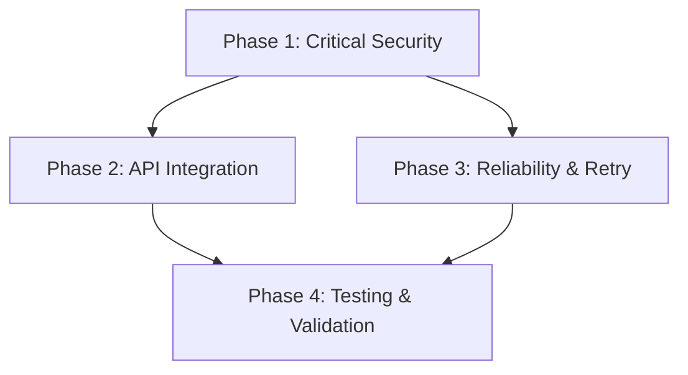

# Implementation Guide: Typeform API Integration Improvements

---
feature: typeform-api-improvements
complexity: detailed
risk_level: high
estimated_time: 12-14 days
phases: 4
---

## Overview
Critical security and compliance improvements to the existing Typeform API integration within the client onboarding context. This implementation addresses placeholder webhook signature verification, automates webhook management, corrects rate limiting configuration, and establishes production-ready retry logic.

**CRITICAL SECURITY ISSUE**: Current webhook signature verification is incomplete (placeholder at `webhook_handler.py:188`)

## Architecture

### Current State
```
WebhookHandler (incomplete security) → ResponseParser → Database Storage
    ↓
TypeFormClient (webhook management exists but underutilized)
```

### Target State  
```
TypeForm Webhook → HMAC-SHA256 Verification → Enhanced WebhookHandler → ResponseParser → Database
    ↓                           ↓
Automated Webhook Management ← Rate-Limited TypeFormClient
    ↓
Retry Logic with Exponential Backoff
```

## Files to Modify/Create

### Core Files
- `src/contexts/client_onboarding/services/webhook_handler.py` - Replace placeholder signature verification (MODIFIED)
- `src/contexts/client_onboarding/services/typeform_client.py` - Enhance webhook management methods (MODIFIED)
- `src/contexts/client_onboarding/config.py` - Fix rate limiting config (MODIFIED)
- `src/contexts/client_onboarding/services/webhook_security.py` - Complete HMAC implementation (MODIFIED)
- `src/contexts/client_onboarding/services/webhook_retry.py` - Production retry logic (NEW)

### Supporting Files
- `src/contexts/client_onboarding/services/exceptions.py` - Webhook retry exceptions (MODIFIED)
- Tests for all security-critical components (NEW)

## Testing Strategy

### Security Testing Commands
```bash
# Unit tests for HMAC verification
poetry run python pytest tests/contexts/client_onboarding/services/test_webhook_security.py -v

# Integration tests for webhook flow
poetry run python pytest tests/contexts/client_onboarding/integration/test_webhook_flow.py -v

# Security penetration tests
poetry run python pytest tests/contexts/client_onboarding/security/ -v
```

### Coverage Requirements
- **Security components**: 95%+ coverage required
- **Webhook handling**: 90%+ coverage required
- **Overall target**: 85%+ coverage

## Phase Dependencies



**Critical Path**: Phase 1 blocks all other work due to security requirements

## Risk Mitigation

### Technical Risks
1. **HMAC Implementation Complexity**: Use Typeform's exact algorithm specification
2. **Rate Limiting Edge Cases**: Implement exponential backoff with proper queue management
3. **Retry Logic Infinite Loops**: Clear timeout boundaries and failure condition handling

### Security Risks
1. **Signature Verification Bypass**: Comprehensive security testing required
2. **Replay Attack Vulnerability**: Implement timestamp validation
3. **Secret Management**: Secure environment variable handling

## Success Criteria

### Phase 1 (Security)
1. Complete HMAC-SHA256 signature verification implemented
2. Security tests passing with 95%+ coverage
3. Audit logging for all verification attempts

### Phase 2 (Integration)
1. Automated webhook management via Typeform API
2. Rate limiting corrected to 2 req/sec
3. Error handling for all webhook operations

### Phase 3 (Reliability)
1. Production-ready retry logic with 2-3 minute intervals
2. Proper failure condition handling (410/404 responses)
3. Comprehensive monitoring and alerting

### Phase 4 (Validation)
1. Security penetration testing passed
2. Full integration testing with live Typeform webhooks
3. Performance testing under load
4. Documentation complete and deployment ready

## Implementation Notes

### Existing Architecture Strengths
- Excellent webhook payload validation (`api_schemas/webhook/typeform_webhook_payload.py`)
- Comprehensive exception handling patterns (`services/exceptions.py`)
- Clean TypeForm client architecture (`typeform_client.py:330-441`)
- Robust response parsing (`core/services/response_parser.py`)

### Key Integration Points
- Leverage existing `TypeFormClient` patterns for webhook management
- Extend current exception hierarchy for retry scenarios
- Maintain webhook payload validation schemas
- Preserve response parsing infrastructure

## Environment Setup
```bash
# Install security dependencies if needed
poetry add cryptography

# Set required environment variables
export TYPEFORM_WEBHOOK_SECRET="your-webhook-secret"
export TYPEFORM_API_KEY="your-api-key"
```

## Quality Gates
- All security tests must pass before proceeding to next phase
- Code review required for all security-critical components
- Performance testing under realistic load conditions
- Security audit before production deployment 