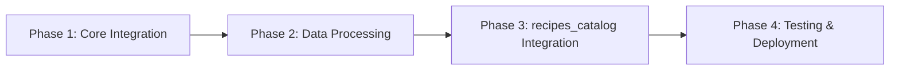

# Implementation Guide: TypeForm Client Onboarding Integration

---
feature: typeform-client-onboarding
complexity: standard
risk_level: medium
estimated_time: 80-120 hours
phases: 4
---

## Overview
Enable app users to create TypeForm-based client onboarding forms, automatically capture responses via webhooks, and store flexible client data for future menu generation. Streamlines client onboarding and prepares foundation for AI-driven menu personalization.

## Architecture
**Simplified Context Design**: Using Pydantic for validation + SQLAlchemy ORM + direct event handling (no DDD patterns, UoW, or message bus)

```
┌─────────────────┐    ┌──────────────────┐    ┌─────────────────┐
│   App Frontend  │───▶│  TypeForm API    │───▶│  AWS Lambda     │
│   (Form Setup)  │    │  (Webhook Config)│    │  (Processing)   │
└─────────────────┘    └──────────────────┘    └─────────────────┘
                                                        │
                                                        ▼
┌─────────────────┐    ┌──────────────────┐    ┌─────────────────┐
│ recipes_catalog │◀───│    PostgreSQL    │◀───│  client_onboard │
│    (Client)     │    │   (JSONB Data)   │    │    (Storage)    │
└─────────────────┘    └──────────────────┘    └─────────────────┘
```

## Files to Modify/Create

### Core Files
- `src/contexts/client_onboarding/` - New bounded context (NEW)
- `src/contexts/client_onboarding/api_schemas/` - Pydantic validation models (NEW)
- `src/contexts/client_onboarding/models/` - SQLAlchemy ORM models (NEW)
- `src/contexts/client_onboarding/services/` - TypeForm API client, webhook processing (NEW)
- `src/contexts/client_onboarding/endpoints/` - FastAPI endpoints (NEW)
- `src/contexts/recipes_catalog/core/domain/client/root_aggregate/client.py` - Add onboarding_data field (MODIFIED)
- `src/contexts/client_onboarding/aws_lambda/` - Webhook handler Lambda function (NEW)
- `src/contexts/client_onboarding/integration/` - recipes_catalog integration (NEW)

### Database
- `migrations/` - Add onboarding_form and form_response tables (NEW)
- `migrations/` - Add onboarding_data field to clients table (NEW)

### Testing
- `tests/contexts/client_onboarding/` - Unit and integration tests (NEW)
- `tests/integration/webhook_processing/` - End-to-end webhook tests (NEW)

## Testing Strategy
- **Unit Tests**: `poetry run python pytest tests/contexts/client_onboarding/unit/`
- **Integration Tests**: `poetry run python pytest tests/contexts/client_onboarding/integration/`
- **Webhook Tests**: `poetry run python pytest tests/integration/webhook_processing/`
- **E2E Manual**: TypeForm form creation → response → client creation workflow
- **Coverage target**: 85%+

## Phase Dependencies


**Critical Path**: TypeForm API integration → Webhook processing → Client model enhancement

## Risk Mitigation
- **TypeForm API Changes**: Use adapter pattern, monitor API versions
- **Webhook Reliability**: Implement retry logic, signature verification
- **Lambda Cold Starts**: Keep functions warm, optimize initialization
- **Data Schema Evolution**: Use JSONB for flexibility, versioning strategy
- **Security**: Input sanitization, user-scoped access controls

## Success Criteria
1. **Integration**: Successfully configure TypeForm webhooks via API
2. **Processing**: 99% webhook processing success rate under 10 seconds
3. **Data Quality**: 95% of form responses successfully stored with proper client identifiers
4. **UX**: Client creation pre-fills with form data, reducing creation time by 50%
5. **Adoption**: 80% of active users create at least one onboarding form

## Environment Setup
```bash
# Install dependencies
poetry install

# Database migrations
alembic upgrade head

# TypeForm API credentials
export TYPEFORM_API_KEY="your_key_here"
export TYPEFORM_WEBHOOK_SECRET="your_secret_here"

# AWS Lambda deployment
sam build && sam deploy
```

## Key Technical Decisions
- **No Domain Models**: Direct SQLAlchemy ORM usage for anemic data structures
- **No Message Bus**: Direct service calls after webhook processing
- **JSONB Storage**: Flexible schema for various TypeForm question types
- **Lambda Webhooks**: Serverless webhook processing for scalability
- **Signature Verification**: TypeForm webhook security implementation 