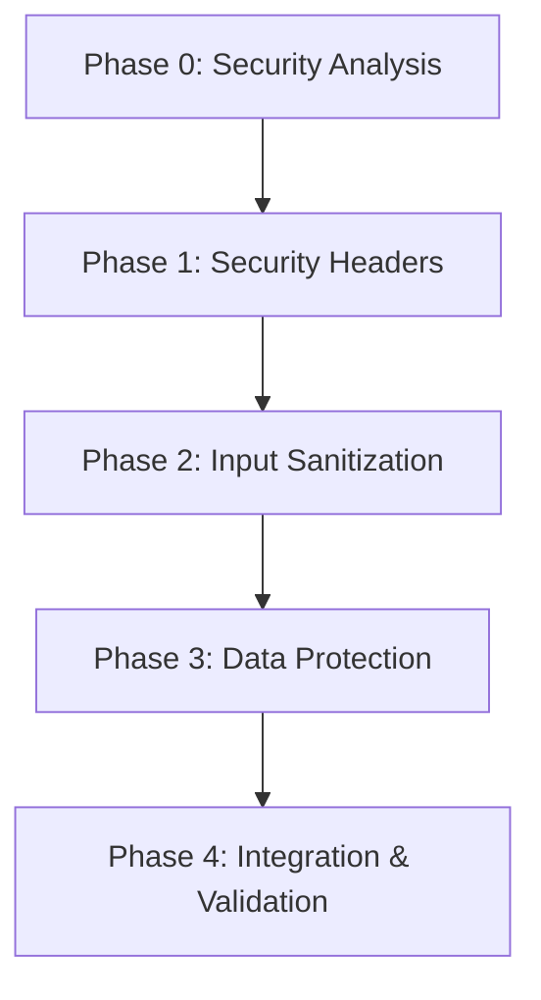

# Implementation Guide: Exception Handler Security Enhancement

---
feature: exception-handler-security
complexity: detailed
risk_level: high
estimated_time: 2-3 days
phases: 5
---

## Overview
Implement comprehensive security enhancements for the exception handler middleware to address 30 failing security tests. Focus on security headers, input sanitization, and data protection while maintaining the existing Ports & Adapters architecture.

## Architecture
Following the project's middleware architecture pattern with Pydantic v2 integration:
- **Strategy Pattern**: Extend existing `ErrorHandlingStrategy` for security features
- **Middleware Composition**: Enhance `ExceptionHandlerMiddleware` without breaking existing behavior
- **Pydantic v2 Integration**: Use existing `BaseApiModel` patterns for security validation and sanitization
- **Response Format**: Maintain existing `ErrorResponse` schema while adding security features
- **AWS Lambda Integration**: Preserve existing Lambda-specific error handling

## Files to Modify/Create
### Core Files
- `src/contexts/shared_kernel/middleware/error_handling/exception_handler.py` - MODIFIED (add security features)
- `src/contexts/shared_kernel/middleware/error_handling/error_response.py` - MODIFIED (add security headers and sanitization)
- `src/contexts/shared_kernel/middleware/error_handling/security_headers.py` - NEW (Pydantic security header models)
- `src/contexts/shared_kernel/middleware/error_handling/sanitized_models.py` - NEW (Pydantic sanitization models)
- `src/contexts/shared_kernel/middleware/error_handling/secure_models.py` - NEW (Pydantic data protection models)

### Test Files
- `tests/security/contexts/shared_kernel/middleware/error_handling/test_exception_handler_security.py` - EXISTING (40 tests, 30 failing)

## Testing Strategy
- Commands: `uv run python -m pytest tests/security/contexts/shared_kernel/middleware/error_handling/ -v`
- Coverage target: 100% (all 40 security tests must pass)
- Approach: TDD - implement features to make failing tests pass

## Phase Dependencies

## Risk Mitigation
- **Backward Compatibility**: Maintain existing error response format
- **Incremental Changes**: Implement features phase by phase
- **Test-Driven**: Use existing security tests as implementation guide
- **Architecture Compliance**: Follow existing middleware patterns

## Success Criteria
1. All 40 security tests pass (currently 30 failing)
2. No breaking changes to existing error response format
3. Security headers included in all error responses
4. Sensitive data properly sanitized
5. Malicious input neutralized in error messages
