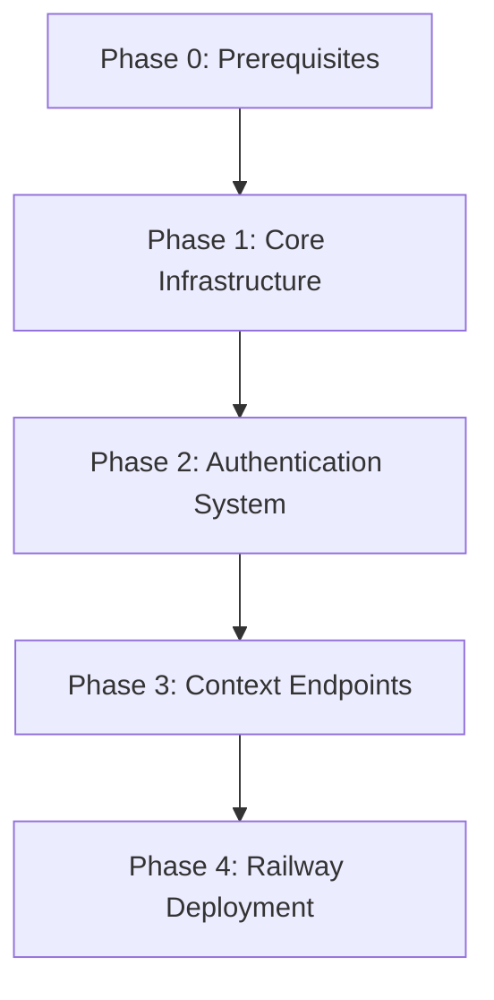

# Implementation Guide: FastAPI Support

---
feature: fastapi-support
complexity: detailed
risk_level: high
estimated_time: 4-5 weeks
phases: 5
---

## Overview
Implement FastAPI runtime support alongside existing AWS Lambda infrastructure, including context-specific routing, Cognito authentication, middleware adaptation, and Railway deployment. Focus on thread safety, async compatibility, and maintaining API response compatibility with Lambda endpoints.

## Architecture
```
┌─────────────────┐    ┌──────────────────┐    ┌─────────────────┐
│   FastAPI App   │    │  Middleware      │    │   Business      │
│                 │    │  System          │    │   Contexts      │
│ ┌─────────────┐ │    │                  │    │                 │
│ │   Routers   │ │◄───┤ Auth Strategy    │◄───┤ Products        │
│ │             │ │    │ Logging          │    │ Recipes         │
│ │ /products   │ │    │ Error Handling   │    │ Client Onboard  │
│ │ /recipes    │ │    │                  │    │ IAM             │
│ │ /forms      │ │    │                  │    │                 │
│ │ /users      │ │    │                  │    │                 │
│ └─────────────┘ │    │                  │    │                 │
└─────────────────┘    └──────────────────┘    └─────────────────┘
         │                       │                       │
         ▼                       ▼                       ▼
┌─────────────────┐    ┌──────────────────┐    ┌─────────────────┐
│   Cognito       │    │   Database       │    │   Message Bus   │
│   JWT Tokens    │    │   PostgreSQL     │    │   & Commands    │
└─────────────────┘    └──────────────────┘    └─────────────────┘
```

## Files to Modify/Create
### Core Files
- `src/runtimes/fastapi/app.py` - FastAPI lifespan management with anyio task supervision (NEW)
- `src/runtimes/fastapi/main.py` - FastAPI application entry point with container integration (NEW)
- `src/runtimes/fastapi/deps.py` - Dependency injection system with MessageBus spawn_fn binding (NEW)
- `src/runtimes/fastapi/middleware/` - FastAPI middleware stack (logging, auth, error handling) (NEW)
- `src/runtimes/fastapi/routers/helpers.py` - Common response helper functions using composition (NEW)
- `src/runtimes/fastapi/routers/` - Context-specific routers using helper functions (NEW)
- `src/contexts/shared_kernel/services/messagebus.py` - Add spawn_fn and handler_limiter support (MODIFIED)
- `pyproject.toml` - Add FastAPI dependencies (MODIFIED)
- `railway.json` - Railway deployment configuration (NEW)

## Testing Strategy
- Commands: `uv run python pytest tests/integration/contexts/fastapi/`
- Coverage target: 90% for new FastAPI components
- Thread safety tests: Concurrent request testing
- Async tests: Proper async/await behavior validation
- Compatibility tests: Response matching with Lambda endpoints

## Phase Dependencies


## Risk Mitigation
- **Thread Safety**: Use thread-safe patterns, avoid shared mutable state, request-scoped dependencies, stateless helper functions
- **Async Compatibility**: Use async-compatible libraries, proper async/await patterns
- **Middleware Integration**: FastAPI native middleware using app.add_middleware() (consistent with AWS Lambda decorators)
- **Composition over Inheritance**: Use helper functions instead of base router classes for better maintainability
- **Performance**: Request-scoped caching, optimization, <200ms response time target

## Implementation Pattern Examples

### Helper Functions Pattern
```python
# src/runtimes/fastapi/routers/helpers.py
from fastapi import APIRouter
from fastapi.responses import JSONResponse
from typing import Any, List

def create_success_response(data: Any, status_code: int = 200) -> JSONResponse:
    """Create standardized success response."""
    return JSONResponse(status_code=status_code, content={"data": data})

def create_paginated_response(data: List[Any], total: int, page: int = 1, limit: int = 50) -> JSONResponse:
    """Create paginated response."""
    return JSONResponse(
        status_code=200,
        content={
            "data": data,
            "pagination": {"page": page, "limit": limit, "total": total, "pages": (total + limit - 1) // limit}
        }
    )

def create_router(prefix: str = "", tags: List[str] = None) -> APIRouter:
    """Create APIRouter with common configuration."""
    return APIRouter(prefix=prefix, tags=tags or [])
```

### Router Implementation Pattern
```python
# src/runtimes/fastapi/routers/products.py
from fastapi import Depends, Query
from src.runtimes.fastapi.routers.helpers import create_success_response, create_paginated_response, create_router
from src.contexts.products_catalog.fastapi.dependencies import get_bus

router = create_router(prefix="/products", tags=["products"])

@router.get("/query")
async def query_products(page: int = Query(1, ge=1), limit: int = Query(50, ge=1, le=100), bus = Depends(get_bus)):
    """Query products with pagination."""
    products = []  # Get from bus
    total = 0      # Get from bus
    return create_paginated_response(data=products, total=total, page=page, limit=limit)

@router.get("/{product_id}")
async def get_product(product_id: str, bus = Depends(get_bus)):
    """Get single product."""
    product = {}  # Get from bus
    return create_success_response(product)
```

### Middleware Stack Pattern
```python
# src/runtimes/fastapi/app.py
from fastapi import FastAPI
from src.runtimes.fastapi.middleware.logging import LoggingMiddleware
from src.runtimes.fastapi.middleware.auth import AuthMiddleware
from src.runtimes.fastapi.middleware.error_handling import ErrorHandlingMiddleware

app = FastAPI()

# Same order as AWS Lambda decorators:
app.add_middleware(LoggingMiddleware, logger_name="fastapi")      # 1. Logging (outermost)
app.add_middleware(AuthMiddleware)                                # 2. Authentication  
app.add_middleware(ErrorHandlingMiddleware)                       # 3. Error handling (innermost)

# Matches AWS Lambda pattern:
# @async_endpoint_handler(
#     aws_lambda_logging_middleware(...),
#     recipes_aws_auth_middleware(),
#     aws_lambda_exception_handler_middleware(...)
# )
```

## Success Criteria
1. All 4 contexts have working FastAPI endpoints
2. Cognito authentication works with JWT token validation and refresh
3. Local development server runs without AWS dependencies
4. API responses match Lambda endpoint responses exactly
5. Thread-safe operation in multithreaded FastAPI environment
